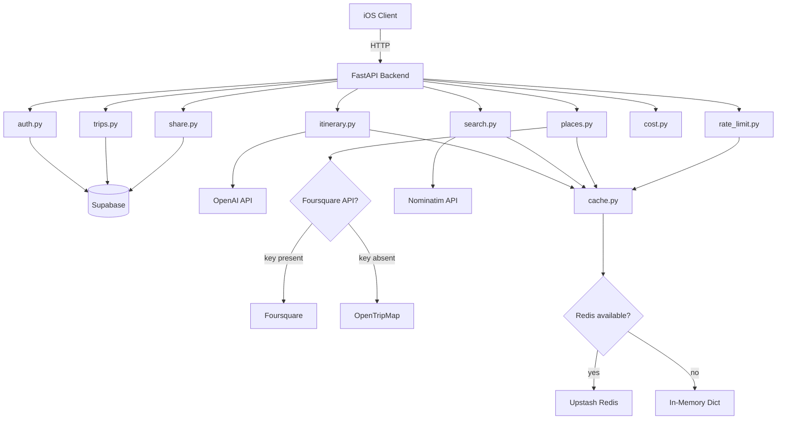

# Design Document: Backend Integrations

## Overview

This feature replaces hardcoded/mock data and paid API dependencies in the Orbi backend with real, free-tier services. The existing FastAPI backend already has well-defined service interfaces — this work wires them to live providers:

- **Supabase** (PostgreSQL) — already used by `trips.py`, `share.py`, `auth.py`; needs a real project with the migration schema applied
- **OpenAI** (`gpt-4o-mini`) — `itinerary.py` already has full prompt/parse logic; just needs a valid `OPENAI_API_KEY`
- **Nominatim** (OpenStreetMap) — replaces Google Places Autocomplete in `search.py` for free geocoding
- **Foursquare free tier / OpenTripMap fallback** — replaces Google Places Nearby Search in `places.py`
- **Upstash Redis with in-memory fallback** — `cache.py` currently requires Redis; add a dict-based fallback
- **New `/search/popular-cities` endpoint** — serves curated city data for GlobeView markers
- **iOS client updates** — SearchService fallback, GlobeView dynamic markers

The key constraint is that only `supabase_url`, `supabase_key`, `openai_api_key`, and `jwt_secret` are required. All other API keys are optional with graceful fallbacks.

## Architecture



### Request Flow

1. iOS `APIClient` sends requests to `http://localhost:8000` (debug) or production URL
2. `JWTAuthMiddleware` validates Bearer token (skips public paths: `/auth`, `/share`, `/health`, `/search`)
3. `RateLimitMiddleware` enforces 100 req/min per user via cache backend
4. Route handler delegates to the appropriate service
5. Services use `cache.py` for caching, which transparently uses Redis or in-memory dict

## Components and Interfaces

### 1. `config.py` — Settings

Current state: All fields are required, including `google_places_api_key` and `upstash_redis_url`.

**Changes:**

```python
class Settings(BaseSettings):
    # Required
    supabase_url: str
    supabase_key: str
    openai_api_key: str
    jwt_secret: str

    # Optional — free-tier services with fallbacks
    upstash_redis_url: str = ""
    google_places_api_key: str = ""  # deprecated, kept for backward compat
    foursquare_api_key: str = ""     # new: Foursquare free tier

    model_config = {"env_file": ".env", "extra": "ignore"}
```

**Rationale:** Making `upstash_redis_url`, `google_places_api_key`, and `foursquare_api_key` optional with empty-string defaults means the backend starts with just the four required vars. Services check for non-empty strings before using optional keys.

### 2. `cache.py` — Cache Service with In-Memory Fallback

Current state: Hard-requires Redis via `redis.from_url()`. No fallback.

**Changes:**

```python
# In-memory fallback store
_memory_store: dict[str, tuple[str, float]] = {}  # key -> (json_value, expires_at)

def get_redis_client() -> redis.Redis | None:
    """Return Redis client if configured, else None."""
    if not settings.upstash_redis_url:
        return None
    # ... existing lazy init with try/except on connection ...

def get_cached(key: str) -> Any | None:
    client = get_redis_client()
    if client is not None:
        try:
            raw = client.get(key)
            return json.loads(raw) if raw else None
        except Exception:
            logger.warning("Redis get failed for key=%s, falling back to memory", key)
    # In-memory fallback
    entry = _memory_store.get(key)
    if entry is None:
        return None
    value, expires_at = entry
    if time.time() > expires_at:
        del _memory_store[key]
        return None
    return json.loads(value)

def set_cached(key: str, value: Any, ttl: int = DEFAULT_TTL) -> None:
    serialized = json.dumps(value)
    client = get_redis_client()
    if client is not None:
        try:
            client.set(key, serialized, ex=ttl)
            return
        except Exception:
            logger.warning("Redis set failed for key=%s, falling back to memory", key)
    # In-memory fallback
    _memory_store[key] = (serialized, time.time() + ttl)
```

**Design decisions:**
- TTL is enforced on read (lazy eviction) for the in-memory store — simple and sufficient for a single-process backend
- Redis errors fall back to in-memory for that operation, not permanently — each call re-attempts Redis
- `get_redis_client()` returns `None` when `upstash_redis_url` is empty, avoiding connection attempts

### 3. `search.py` — Nominatim Integration

Current state: Calls Google Places Autocomplete + Details APIs.

**Changes:** Replace with Nominatim `/search` endpoint.

```python
NOMINATIM_SEARCH_URL = "https://nominatim.openstreetmap.org/search"
USER_AGENT = "Orbi/1.0 (travel-planner)"

async def search_destinations(query: str) -> list[dict[str, Any]]:
    cache_k = _cache_key(query)
    cached = get_cached(cache_k)
    if cached is not None:
        return cached

    async with httpx.AsyncClient(timeout=10.0) as client:
        resp = await client.get(
            NOMINATIM_SEARCH_URL,
            params={
                "q": query,
                "format": "json",
                "addressdetails": "1",
                "featuretype": "city",
                "limit": "5",
            },
            headers={"User-Agent": USER_AGENT},
        )
        resp.raise_for_status()
        data = resp.json()

    results = [
        {
            "name": item.get("display_name", ""),
            "place_id": str(item.get("place_id", "")),
            "latitude": float(item.get("lat", 0)),
            "longitude": float(item.get("lon", 0)),
        }
        for item in data
        if item.get("type") in ("city", "town", "administrative", "village")
           or item.get("class") == "place"
    ]

    set_cached(cache_k, results, CACHE_TTL)
    return results
```

**Key differences from Google Places:**
- Single HTTP call instead of Autocomplete + Details (Nominatim returns lat/lon directly)
- `featuretype=city` parameter pre-filters, plus client-side type/class filtering
- `User-Agent` header required by Nominatim usage policy
- On error, returns empty list and logs (no RuntimeError propagation — graceful degradation)

### 4. `search.py` — Popular Cities Endpoint

New function returning a curated list of 20 popular travel cities:

```python
POPULAR_CITIES_CACHE_KEY = "search:popular_cities"
POPULAR_CITIES_TTL = 604800  # 7 days

POPULAR_CITIES = [
    {"name": "Tokyo, Japan", "latitude": 35.6762, "longitude": 139.6503},
    {"name": "Paris, France", "latitude": 48.8566, "longitude": 2.3522},
    # ... 18 more curated cities ...
]

async def get_popular_cities() -> list[dict[str, Any]]:
    cached = get_cached(POPULAR_CITIES_CACHE_KEY)
    if cached is not None:
        return cached
    set_cached(POPULAR_CITIES_CACHE_KEY, POPULAR_CITIES, ttl=POPULAR_CITIES_TTL)
    return POPULAR_CITIES
```

New route in `routes/search.py`:

```python
@router.get("/popular-cities")
async def popular_cities():
    results = await get_popular_cities()
    return {"results": results}
```

The `/search/popular-cities` path is public because `/search` is not in `PUBLIC_PATH_PREFIXES` but we need to add it. Since `/search/destinations` requires auth, we'll add `/search/popular-cities` specifically to the public paths list in `jwt_auth.py`.

### 5. `places.py` — Foursquare / OpenTripMap Integration

Current state: Calls Google Places Nearby Search API.

**Changes:** Replace with Foursquare Places API (free tier: 950 calls/day) or OpenTripMap fallback.

```python
FOURSQUARE_SEARCH_URL = "https://api.foursquare.com/v3/places/search"
OPENTRIPMAP_SEARCH_URL = "https://api.opentripmap.com/0.1/en/places/radius"

def _use_foursquare() -> bool:
    return bool(settings.foursquare_api_key)

async def _fetch_foursquare(place_type: str, query: PlaceQuery, keyword: str | None) -> list[dict]:
    categories = "19014" if place_type == "lodging" else "13000"  # FSQ category IDs
    params = {
        "ll": f"{query.latitude},{query.longitude}",
        "radius": query.radius,
        "categories": categories,
        "limit": 10,
    }
    if keyword:
        params["query"] = keyword
    headers = {
        "Authorization": settings.foursquare_api_key,
        "Accept": "application/json",
    }
    async with httpx.AsyncClient(timeout=10.0) as client:
        resp = await client.get(FOURSQUARE_SEARCH_URL, params=params, headers=headers)
        resp.raise_for_status()
    return resp.json().get("results", [])

async def _fetch_opentripmap(place_type: str, query: PlaceQuery) -> list[dict]:
    kinds = "accomodations" if place_type == "lodging" else "foods"
    params = {
        "radius": query.radius,
        "lon": query.longitude,
        "lat": query.latitude,
        "kinds": kinds,
        "format": "json",
        "limit": 10,
    }
    async with httpx.AsyncClient(timeout=10.0) as client:
        resp = await client.get(OPENTRIPMAP_SEARCH_URL, params=params)
        resp.raise_for_status()
    return resp.json()
```

**Venue-to-PlaceResult mapping** adapts per provider:
- Foursquare: `fsq_id` → `place_id`, `name`, `rating` (from `/details`), `location.latitude/longitude`
- OpenTripMap: `xid` → `place_id`, `name`, `rate` → `rating`, `point.lat/lon`

**Fallback logic:** `_use_foursquare()` checks `settings.foursquare_api_key`. If empty, all calls go to OpenTripMap (no auth needed).

### 6. `itinerary.py` — OpenAI Integration (Existing)

The itinerary service already has complete OpenAI integration. No structural changes needed — it works once `OPENAI_API_KEY` is set.

**Prompt structure (documented for reference):**

- **System message:** "You are a travel planning assistant. Return ONLY valid JSON, no markdown fences or extra text."
- **User message:** Built by `_build_prompt()` containing destination, num_days, vibe, cuisine/price preferences, and the exact JSON schema to return
- **Model:** `gpt-4o-mini` (cheapest, sufficient for structured output)
- **Temperature:** 0.7 for generation, 0.8 for replacement (slightly more creative)
- **Response parsing:** Strip markdown fences if present, `json.loads()`, then Pydantic validation via `_parse_itinerary_response()`
- **Travel time validation:** `_validate_travel_times()` clamps any `travel_time_to_next_min > 60` to 60

### 7. `rate_limit.py` — Resilience Without Redis

Current state: Directly calls `get_redis_client()` which fails if Redis is unavailable.

**Changes:**

```python
async def dispatch(self, request: Request, call_next):
    user_id = getattr(request.state, "user_id", None)
    if user_id is None:
        return await call_next(request)

    try:
        redis_client = get_redis_client()
        if redis_client is None:
            # No Redis configured — use in-memory counter
            return self._check_memory_limit(user_id, request, call_next)
        key = f"ratelimit:{user_id}"
        current_count = redis_client.incr(key)
        if current_count == 1:
            redis_client.expire(key, WINDOW_SECONDS)
        if current_count > RATE_LIMIT:
            return JSONResponse(status_code=429, content={...})
    except Exception:
        logger.warning("Rate limit check failed, allowing request through")
        return await call_next(request)

    return await call_next(request)
```

An in-memory dict `_memory_counters: dict[str, tuple[int, float]]` tracks `(count, window_start)` per user. On Redis error, the request is allowed through (fail-open).

### 8. iOS Client Changes

#### `SearchService.swift`

Already has the correct structure — calls `GET /search/destinations?q=` and falls back to `localCities`. No changes needed to the fallback logic. The debounce (Req 7.4) should be added in the view layer or as a `Task.sleep` before calling `searchDestinations`.

#### `GlobeView.swift`

**Changes:**
- Add a `loadPopularCities()` async function that calls `GET /search/popular-cities`
- On success, replace `CityMarker.popularCities` with the backend response
- On failure, keep using the hardcoded `popularCities` array
- The `CityMarker` struct gains an `init(from:)` that maps the backend JSON

```swift
// In Coordinator or a new ViewModel
func loadPopularCities() async {
    do {
        let response: PopularCitiesResponse = try await APIClient.shared.request(
            .get, path: "/search/popular-cities", requiresAuth: false
        )
        self.cities = response.results.map { CityMarker(name: $0.name, latitude: $0.latitude, longitude: $0.longitude) }
    } catch {
        self.cities = CityMarker.popularCities  // fallback
    }
}
```

## Data Models

### Existing Models (Unchanged)

- `ItineraryRequest`, `ItineraryResponse`, `ActivitySlot`, `ItineraryDay`, `RestaurantRecommendation` — in `models/itinerary.py`
- `PlaceQuery`, `PlaceResult`, `PlacesResponse` — in `models/places.py`
- `CostRequest`, `CostBreakdown` — in `models/cost.py`

### Updated Models

**`config.py` Settings:**
```
supabase_url: str          (required)
supabase_key: str          (required)
openai_api_key: str        (required)
jwt_secret: str            (required)
upstash_redis_url: str     (optional, default "")
google_places_api_key: str (optional, default "")
foursquare_api_key: str    (optional, default "")
```

### New Response Models

**Popular Cities Response** (used by `/search/popular-cities`):
```python
class PopularCity(BaseModel):
    name: str
    latitude: float
    longitude: float

class PopularCitiesResponse(BaseModel):
    results: list[PopularCity]
```

### Database Schema (Unchanged)

The migration at `001_initial_schema.sql` defines `users`, `refresh_tokens`, `trips`, `shared_trips` with RLS policies. No schema changes are needed — the Supabase project just needs this migration applied.


## Correctness Properties

*A property is a characteristic or behavior that should hold true across all valid executions of a system — essentially, a formal statement about what the system should do. Properties serve as the bridge between human-readable specifications and machine-verifiable correctness guarantees.*

### Property 1: Itinerary Prompt Completeness

*For any* valid `ItineraryRequest` with arbitrary destination, num_days (1–14), and vibe, the prompt built by `_build_prompt()` SHALL contain the destination name, the num_days value, the vibe string, and the JSON schema template. When a valid JSON response matching the schema is returned, `_parse_itinerary_response()` SHALL produce an `ItineraryResponse` with the correct number of days and 3 slots per day.

**Validates: Requirements 2.2**

### Property 2: Replace Activity Prompt Includes Existing Activities

*For any* `ReplaceActivityRequest` with a non-empty `existing_activities` list, the prompt built by `_build_replace_prompt()` SHALL contain every activity name from the `existing_activities` list as a substring.

**Validates: Requirements 2.4**

### Property 3: Nominatim Result Mapping

*For any* Nominatim result dict containing `display_name`, `place_id`, `lat`, and `lon` fields, the mapping function SHALL produce a destination suggestion dict with non-empty `name`, non-empty `place_id`, and numeric `latitude` and `longitude` values.

**Validates: Requirements 3.3**

### Property 4: Nominatim City Type Filtering

*For any* list of Nominatim results with mixed `type` values (city, town, administrative, village, building, road, etc.), the filter SHALL include only results whose `type` is in `{city, town, administrative, village}` or whose `class` is `place`, and SHALL exclude all others.

**Validates: Requirements 3.4**

### Property 5: Place Results Sorted by Rating, Top 3

*For any* list of `PlaceResult` objects with arbitrary ratings, the sorting/selection logic SHALL return at most 3 results, and those results SHALL be in descending order of rating.

**Validates: Requirements 4.4**

### Property 6: Excluded IDs Filtering

*For any* list of `PlaceResult` objects and any set of `excluded_ids`, none of the returned results SHALL have a `place_id` that appears in the `excluded_ids` set.

**Validates: Requirements 4.5**

### Property 7: Cache Round-Trip

*For any* JSON-serializable Python value (dict, list, string, number, bool, None), calling `set_cached(key, value)` followed by `get_cached(key)` SHALL return a value equal to the original.

**Validates: Requirements 5.4, 5.5**

### Property 8: Cache TTL Eviction

*For any* key stored in the in-memory cache with a TTL of T seconds, calling `get_cached(key)` after T seconds have elapsed SHALL return `None`, and calling `get_cached(key)` before T seconds have elapsed SHALL return the stored value.

**Validates: Requirements 5.3, 5.6**

### Property 9: Settings Required Fields Validation

*For any* single required field omitted from `{supabase_url, supabase_key, openai_api_key, jwt_secret}`, instantiating `Settings` SHALL raise a `ValidationError` that names the missing field.

**Validates: Requirements 6.4, 6.6**

### Property 10: Venue-to-PlaceResult Mapping

*For any* Foursquare venue dict (or OpenTripMap result dict) containing location coordinates and a name, the mapping function SHALL produce a `PlaceResult` with non-empty `place_id`, non-empty `name`, and numeric `latitude` and `longitude` values.

**Validates: Requirements 4.3**

## Error Handling

| Scenario | Behavior |
|---|---|
| Supabase unreachable at startup | Log error with expected env var names; backend still starts (lazy client init means first DB call fails, not startup) |
| OpenAI API error / timeout | `RuntimeError` raised with HTTP status or timeout detail; route returns 500 |
| OpenAI returns malformed JSON | `RuntimeError("Failed to parse itinerary from AI response")`; route returns 500 |
| Nominatim unreachable / error | Return empty list `[]`, log warning; iOS falls back to local cities |
| Foursquare API error | Log error, attempt OpenTripMap fallback if no FSQ key; if both fail, return empty `PlacesResponse` |
| Redis connection failure (cache) | Log warning, fall back to in-memory dict for that operation |
| Redis connection failure (rate limiter) | Log warning, allow request through (fail-open) |
| Missing required env var | `pydantic.ValidationError` at import time with field name |
| iOS backend unreachable | `SearchService` falls back to local city list; `GlobeView` uses hardcoded markers |
| 401 from backend | iOS `APIClient` attempts token refresh + retry once; on second failure, throws `.unauthorized` |
| 429 from backend | iOS `APIClient` throws `.rateLimited` with user-friendly message |

## Testing Strategy

### Unit Tests (Example-Based)

Focus on specific scenarios and error conditions:

- **config.py:** Verify optional fields default to `""`, required fields raise `ValidationError` when missing
- **cache.py:** Redis fallback on connection error, in-memory TTL eviction with mocked time
- **search.py:** Nominatim happy path (mock httpx), empty results, API error returns `[]`, User-Agent header present, cache hit skips HTTP call
- **places.py:** Foursquare vs OpenTripMap selection based on `foursquare_api_key`, filter broadening when results empty, Google Places references removed
- **itinerary.py:** OpenAI error raises RuntimeError, malformed JSON raises RuntimeError (existing tests cover this)
- **rate_limit.py:** Redis unavailable uses in-memory counter, Redis error allows request through
- **routes/search.py:** `/search/popular-cities` returns 15–25 cities, is publicly accessible

### Property-Based Tests (Hypothesis)

The project uses Python with pytest, so **Hypothesis** is the appropriate PBT library.

Each property test runs a minimum of 100 iterations and is tagged with its design property reference.

| Property | Test Description | Tag |
|---|---|---|
| 1 | Generate random `ItineraryRequest`, verify prompt contains all fields | `Feature: backend-integrations, Property 1: Itinerary prompt completeness` |
| 2 | Generate random `ReplaceActivityRequest`, verify prompt contains all existing activities | `Feature: backend-integrations, Property 2: Replace activity prompt includes existing activities` |
| 3 | Generate random Nominatim result dicts, verify mapping output | `Feature: backend-integrations, Property 3: Nominatim result mapping` |
| 4 | Generate mixed-type Nominatim results, verify filtering | `Feature: backend-integrations, Property 4: Nominatim city type filtering` |
| 5 | Generate random PlaceResult lists, verify sort + top 3 | `Feature: backend-integrations, Property 5: Place results sorted by rating top 3` |
| 6 | Generate random results + excluded_ids, verify no excluded IDs in output | `Feature: backend-integrations, Property 6: Excluded IDs filtering` |
| 7 | Generate random JSON-serializable values, verify set/get round-trip | `Feature: backend-integrations, Property 7: Cache round-trip` |
| 8 | Generate random TTLs, verify eviction timing | `Feature: backend-integrations, Property 8: Cache TTL eviction` |
| 9 | Omit each required Settings field, verify ValidationError | `Feature: backend-integrations, Property 9: Settings required fields validation` |
| 10 | Generate random venue dicts, verify PlaceResult mapping | `Feature: backend-integrations, Property 10: Venue-to-PlaceResult mapping` |

### Integration Tests

Manual or CI-based tests against real services:

- Backend starts with valid `.env`, `/health` returns 200
- Search query returns Nominatim results end-to-end
- Itinerary generation returns valid response from OpenAI
- Place search returns Foursquare/OpenTripMap results
- iOS client connects to running backend, receives real data

### Dependencies

Add to `requirements.txt`:
```
hypothesis>=6.0
```
