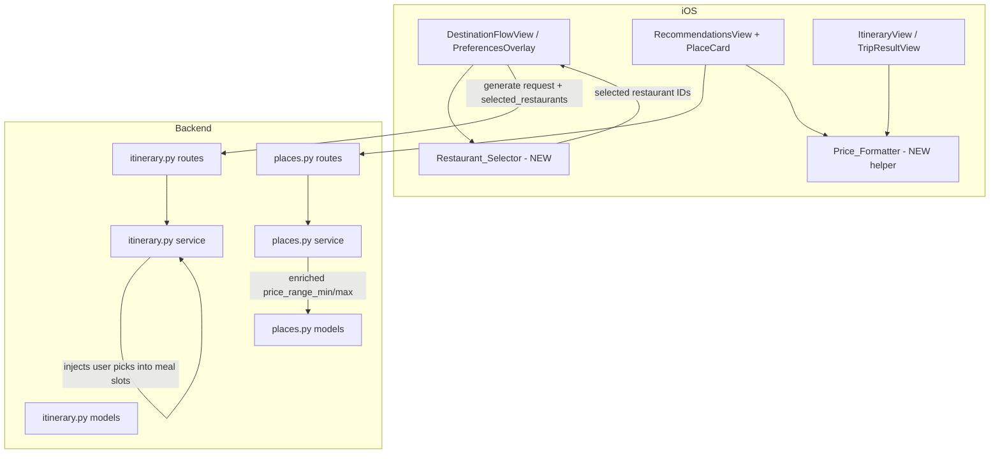

# Design Document: Data Trust & Clarity

## Overview

This feature improves user confidence in the Orbi travel app by making data sources, pricing, and item origins transparent. It spans both the iOS frontend (Swift/SwiftUI) and the Python/FastAPI backend, touching the trip setup flow, itinerary rendering, place recommendations, and pricing display.

Key changes:
- A new Restaurant_Selector component in the trip setup flow lets users optionally pre-select up to 3 restaurants before itinerary generation.
- The Itinerary_Engine injects user-selected restaurants into meal slots and marks all items with an origin label ("Selected by you" / "Suggested").
- Hotel and restaurant pricing shifts from opaque dollar-sign tiers to numeric estimates ($XXX/night avg, $XX–$XX per person) with an "Estimated" qualifier.
- Every location card gains a small "View" external link that opens Google Maps search.
- Rating displays gain source attribution (e.g. "4.5 (Foursquare)") and hide when no rating exists.
- The backend enriches place results with `price_range_min` / `price_range_max` fields.
- All new UI elements follow strict density constraints using existing DesignTokens.

## Architecture

The feature follows the existing layered architecture with minimal new surface area:



### Data Flow

1. **Trip Setup**: User selects a city → PreferencesOverlay appears → Restaurant_Selector loads restaurants via `GET /places/restaurants` → user optionally toggles up to 3 → taps "Generate Itinerary".
2. **Generation**: `POST /trips/generate` now accepts an optional `selected_restaurants` list. The Itinerary_Engine injects these into lunch/dinner slots, marks them `origin: "user"`, and fills remaining days with AI-generated restaurants marked `origin: "ai"`.
3. **Display**: ItineraryView and PlaceCard read origin labels, numeric pricing, rating source, and external link URL from the response models. Price_Formatter converts raw data to display strings.

## Components and Interfaces

### 1. Restaurant_Selector (iOS — new component)

A horizontal scroll of compact restaurant cards embedded in PreferencesOverlay, below the existing vibe pills.

**Interface:**
```swift
struct RestaurantSelector: View {
    @ObservedObject var viewModel: RecommendationsViewModel
    @Binding var selectedRestaurantIds: Set<String>
    let maxSelections: Int // = 3
}
```

- Reuses the existing `RecommendationsViewModel.loadRestaurants()` to fetch data.
- Each card shows name, cuisine, and formatted price range.
- Selection is toggled on tap; capped at `maxSelections`.
- Renders as a horizontal `ScrollView` with compact cards — no new full-screen section.

### 2. ItineraryRequest Extension (Backend)

Add an optional field to `ItineraryRequest`:

```python
class ItineraryRequest(BaseModel):
    # ... existing fields ...
    selected_restaurants: list[SelectedRestaurant] | None = None

class SelectedRestaurant(BaseModel):
    name: str
    cuisine: str
    price_level: str
    latitude: float
    longitude: float
```

### 3. Itinerary_Engine Injection Logic (Backend — itinerary.py)

After OpenAI generates the base itinerary:
- If `selected_restaurants` is provided and non-empty, replace the `restaurant` field on the first N days (where N = len(selected_restaurants)) with the user's picks.
- Set `origin: "user"` on injected restaurants and `origin: "ai"` on all others.
- Ensure no duplicates — each selected restaurant appears at most once.

### 4. Origin Labels (iOS — ItineraryView, TripResultView)

Add an `origin` field to `ItineraryRestaurant` and `ActivitySlot` (optional, defaults to `"ai"`).

Display logic in slot/restaurant cards:
```swift
Text(origin == "user" ? "Selected by you" : "Suggested")
    .font(.caption2)
    .foregroundStyle(DesignTokens.textTertiary)
```

### 5. Price_Formatter (iOS — new utility)

A pure enum with static methods for formatting prices:

```swift
enum PriceFormatter {
    static func hotelPrice(min: Double?, max: Double?, tier: String) -> String
    static func restaurantPrice(min: Double?, max: Double?, tier: String) -> String
    static func restaurantPriceFromTier(_ tier: String) -> String
}
```

- Hotel: returns `"$XXX / night avg"` — average of min/max, or tier fallback ($80/$150/$250).
- Restaurant: returns `"$XX–$XX per person"` — min/max directly, or tier fallback ($10–20/$20–40/$40–70).
- Used by PlaceCard, ItineraryView restaurant rows, and Restaurant_Selector.

### 6. External_Link (iOS — shared component)

A small tappable element added to PlaceCard and itinerary slot/restaurant rows:

```swift
struct ExternalLinkButton: View {
    let placeName: String
    let city: String
    // Opens: https://www.google.com/maps/search/?api=1&query={name}+{city}
}
```

Renders as a caption-sized "View" text or small icon in `accentCyan`.

### 7. Rating_Display Enhancement (iOS — PlaceCard, ItineraryView)

- Format: `"4.5 (Foursquare)"` using `ratingSource` field.
- Optionally append `"(1,200 reviews)"` when `reviewCount` is available.
- Hide the entire rating element when `rating == 0` or `rating` is nil.
- Apply same format in itinerary restaurant rows.

### 8. Backend Price Enrichment (Backend — places.py)

In `_fetch_openai_places` and `_parse_foursquare_result`, populate `price_range_min` and `price_range_max` based on tier mapping:

| Tier | Restaurant min/max | Hotel min/max |
|------|-------------------|---------------|
| $    | 10 / 20           | 60 / 100      |
| $$   | 20 / 40           | 120 / 180     |
| $$$  | 40 / 70           | 200 / 300     |


## Data Models

### Backend Model Changes

**`backend/models/itinerary.py`** — new/modified models:

```python
class SelectedRestaurant(BaseModel):
    """A user-selected restaurant passed into itinerary generation."""
    name: str
    cuisine: str
    price_level: str
    latitude: float
    longitude: float

class ItineraryRequest(BaseModel):
    # ... existing fields unchanged ...
    selected_restaurants: list[SelectedRestaurant] | None = Field(
        None, description="User pre-selected restaurants to inject into meal slots"
    )

class RestaurantRecommendation(BaseModel):
    # ... existing fields unchanged ...
    origin: str | None = Field(None, description="'user' or 'ai' — source of this restaurant")
```

**`backend/models/places.py`** — already has `price_range_min` and `price_range_max` on `PlaceResult`. No schema changes needed; the service layer just needs to populate them.

### iOS Model Changes

**`TripModels.swift`**:

```swift
// Add origin to ItineraryRestaurant
struct ItineraryRestaurant: Codable {
    let name: String
    let cuisine: String
    let priceLevel: String
    let rating: Double
    let latitude: Double
    let longitude: Double
    let imageUrl: String?
    let origin: String?  // NEW — "user" or "ai"
}

// Add selected_restaurants to TripPreferencesRequest
struct TripPreferencesRequest: Encodable {
    // ... existing fields ...
    let selectedRestaurants: [SelectedRestaurantPayload]?  // NEW
}

struct SelectedRestaurantPayload: Encodable {
    let name: String
    let cuisine: String
    let priceLevel: String
    let latitude: Double
    let longitude: Double
}
```

### Existing Fields Already Present

- `PlaceRecommendation` already has `ratingSource`, `reviewCount`, `priceRangeMin`, `priceRangeMax` — no changes needed.
- `PlaceResult` (backend) already has `rating_source`, `review_count`, `price_range_min`, `price_range_max` — no changes needed.


## Correctness Properties

*A property is a characteristic or behavior that should hold true across all valid executions of a system — essentially, a formal statement about what the system should do. Properties serve as the bridge between human-readable specifications and machine-verifiable correctness guarantees.*

### Property 1: Restaurant selection toggle is an involution

*For any* restaurant and any initial selection state (selected or unselected), toggling the restaurant's selection twice should restore the original selection state.

**Validates: Requirements 1.2**

### Property 2: Restaurant selection count never exceeds maximum

*For any* sequence of toggle operations on any set of restaurants, the number of selected restaurants should never exceed 3.

**Validates: Requirements 1.3**

### Property 3: Selected restaurants are injected exactly once

*For any* list of user-selected restaurants (1–3) and any generated itinerary, after injection each selected restaurant should appear exactly once across all itinerary days, and no two days should share the same selected restaurant.

**Validates: Requirements 2.1, 2.3**

### Property 4: Every itinerary day has a restaurant

*For any* itinerary with N days and M selected restaurants (0 ≤ M ≤ 3, M ≤ N), after injection every day should have a non-nil restaurant assigned — M days with user-selected restaurants and (N − M) days with AI-generated restaurants.

**Validates: Requirements 2.4**

### Property 5: Origin label maps correctly

*For any* itinerary item, if its origin is "user" the displayed label should be "Selected by you", and if its origin is "ai" (or nil) the displayed label should be "Suggested".

**Validates: Requirements 3.1, 3.2**

### Property 6: Hotel price format is always numeric

*For any* hotel PlaceRecommendation with any combination of priceRangeMin, priceRangeMax, and priceLevel values, the formatted hotel price string should match the pattern `$\d+ / night avg` and should never be a standalone dollar-sign tier string.

**Validates: Requirements 4.1, 4.5**

### Property 7: Hotel price uses average of min and max

*For any* hotel with positive priceRangeMin and priceRangeMax values, the numeric amount in the formatted hotel price should equal the integer average of (min + max) / 2.

**Validates: Requirements 4.3**

### Property 8: Restaurant price format is always a numeric range

*For any* restaurant PlaceRecommendation or itinerary restaurant with any combination of price data, the formatted restaurant price string should match the pattern `$\d+–$\d+ per person` and should never be a standalone dollar-sign tier string.

**Validates: Requirements 5.1, 5.5, 6.1**

### Property 9: Restaurant price uses min and max directly

*For any* restaurant with positive priceRangeMin and priceRangeMax values, the formatted restaurant price should contain exactly those min and max values as the range bounds.

**Validates: Requirements 5.3**

### Property 10: External link URL format

*For any* place name and city string, the constructed external link URL should be a valid URL matching the format `https://www.google.com/maps/search/?api=1&query={encoded_name}+{encoded_city}` with proper percent-encoding of special characters.

**Validates: Requirements 7.3**

### Property 11: Rating display includes source attribution

*For any* place with a rating > 0 and a non-nil ratingSource, the formatted rating display should contain both the numeric rating and the source name in parentheses.

**Validates: Requirements 8.1**

### Property 12: Zero or missing ratings are hidden

*For any* place with rating == 0 or rating == nil, the rating display element should not be rendered (hidden).

**Validates: Requirements 8.3**

### Property 13: Tier-to-range mapping is consistent

*For any* price tier string ("$", "$$", "$$$") and place type (hotel or restaurant), the `price_range_min` and `price_range_max` values produced by the backend enrichment should match the defined mapping table, and min should always be less than max.

**Validates: Requirements 9.1, 9.2, 9.3**


## Error Handling

### Restaurant_Selector

- If `GET /places/restaurants` fails during trip setup, the Restaurant_Selector shows an inline error banner with a retry button (reuses existing `errorBanner` pattern from RecommendationsView).
- If the restaurant list is empty, the selector section is hidden entirely — the user can still generate an itinerary without pre-selections.

### Itinerary Injection

- If `selected_restaurants` contains invalid data (e.g. missing name), the backend ignores those entries and proceeds with the valid ones.
- If all selected restaurants are invalid, the engine falls back to full AI generation (equivalent to no pre-selections).

### Price_Formatter

- If `priceRangeMin` or `priceRangeMax` is nil, zero, or negative, the formatter falls back to tier-based mapping.
- If `priceLevel` is an unrecognized string, the formatter defaults to the mid-tier fallback ($150/night for hotels, $20–$40 for restaurants).

### External_Link

- If URL construction fails (e.g. encoding error), the "View" link is hidden for that item.
- If the system browser cannot open the URL, the tap is silently ignored (standard `UIApplication.open` behavior).

### Rating_Display

- If `rating` is 0 or nil, the entire rating element is hidden — no empty stars or "0.0" shown.
- If `ratingSource` is nil but rating > 0, the rating is shown without source attribution (just the number).

### Backend Enrichment

- If tier-to-range mapping encounters an unrecognized tier string, it defaults to mid-tier values.
- Existing Foursquare results that already have numeric price data from the API are used as-is (no override).

## Testing Strategy

### Unit Tests (Example-Based)

- **Restaurant_Selector rendering**: Verify the selector appears in PreferencesOverlay, shows restaurant cards, and hides when no restaurants are available.
- **Tier fallback values**: Test each specific tier mapping ($ → $80, $$ → $150, $$$ → $250 for hotels; $ → $10–$20, $$ → $20–$40, $$$ → $40–$70 for restaurants).
- **"Estimated" label presence**: Verify the label appears adjacent to prices in PlaceCard and itinerary rows.
- **External_Link rendering**: Verify the "View" link appears on PlaceCard and itinerary items.
- **Rating hidden when zero**: Verify the rating element is not rendered when rating is 0.
- **UI density**: Snapshot tests to verify new elements use correct DesignTokens (caption2, textTertiary, accentCyan).

### Property-Based Tests

Property-based testing is appropriate for this feature because it contains multiple pure formatting functions (Price_Formatter, URL construction, origin label mapping) and state management logic (selection toggle, injection) with clear input/output behavior and large input spaces.

**Library**: [swift-testing](https://github.com/apple/swift-testing) with custom generators for iOS; [Hypothesis](https://hypothesis.readthedocs.io/) for Python backend.

**Configuration**: Minimum 100 iterations per property test.

**Tag format**: `Feature: data-trust-clarity, Property {number}: {property_text}`

Properties to implement:
1. Toggle involution (Swift — RecommendationsViewModel)
2. Selection cap at 3 (Swift — RecommendationsViewModel)
3. Selected restaurants injected exactly once (Python — itinerary.py injection logic)
4. Every day has a restaurant (Python — itinerary.py injection logic)
5. Origin label mapping (Swift — pure function)
6. Hotel price format (Swift — PriceFormatter)
7. Hotel price average (Swift — PriceFormatter)
8. Restaurant price format (Swift — PriceFormatter)
9. Restaurant price min/max (Swift — PriceFormatter)
10. External link URL format (Swift — URL construction)
11. Rating display format (Swift — formatting logic)
12. Zero ratings hidden (Swift — conditional rendering logic)
13. Tier-to-range mapping (Python — places.py enrichment)

### Integration Tests

- End-to-end: `POST /trips/generate` with `selected_restaurants` returns an itinerary where user picks appear in restaurant slots with `origin: "user"`.
- `GET /places/restaurants` returns results with populated `price_range_min` and `price_range_max`.
- `GET /places/hotels` returns results with populated `price_range_min` and `price_range_max`.
