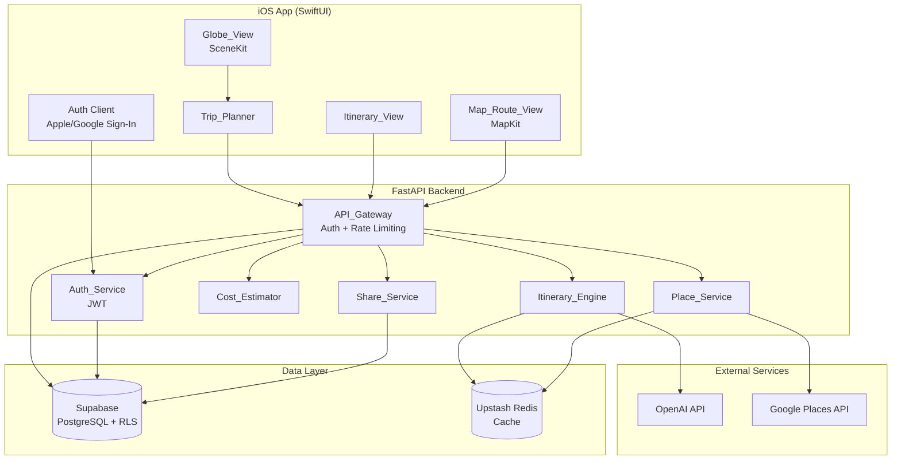
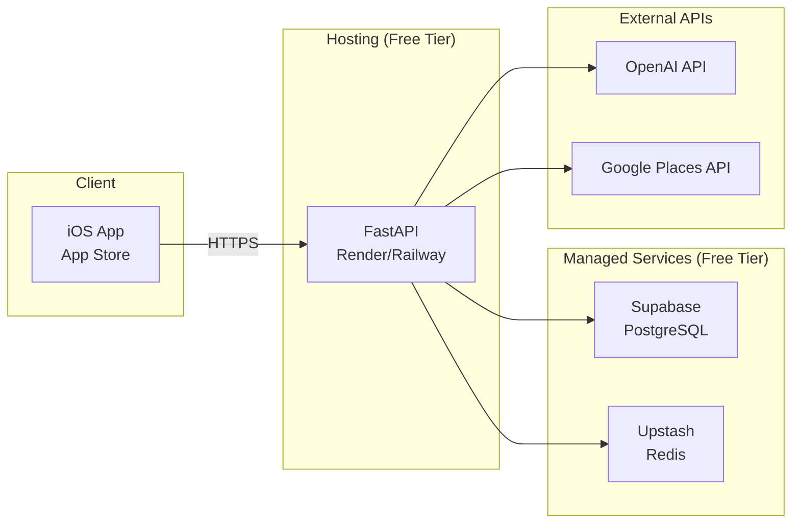
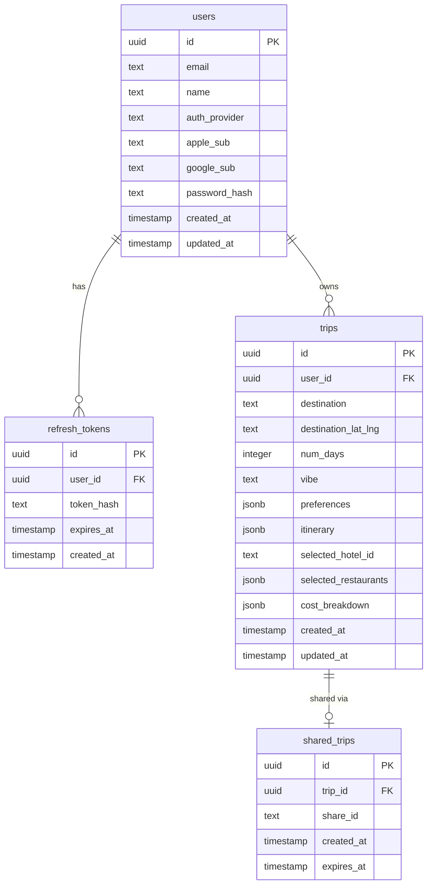

# Design Document: Orbi

## Overview

Orbi is an iOS travel planning app built with SwiftUI, SceneKit, and Apple MapKit on the frontend, backed by a FastAPI (Python) server, Supabase (PostgreSQL) for persistence, Upstash Redis for caching, and OpenAI for AI-powered itinerary generation. The app's signature feature is a 3D interactive globe for destination discovery.

The system follows a client-server architecture where the iOS app handles all rendering, gesture interaction, and local state, while the backend orchestrates external API calls (OpenAI, Google Places), enforces auth/security, and manages persistence. All infrastructure runs on free-tier services.

### Key Design Decisions

- **SceneKit over MapboxGL/CesiumJS**: SceneKit is native to iOS, requires no third-party SDK, and provides hardware-accelerated 3D rendering with built-in gesture recognizers. It avoids web-based globe libraries that would require a WKWebView bridge.
- **FastAPI as API Gateway**: Lightweight, async-native Python framework. Ideal for orchestrating multiple external API calls concurrently (OpenAI + Places). Free to host on Render/Railway free tier.
- **Supabase over raw PostgreSQL**: Provides built-in RLS, auth helpers, REST API, and a generous free tier (500MB DB, 1GB storage). Eliminates the need to self-manage a database.
- **Upstash Redis over in-memory caching**: Serverless Redis with a free tier (10K commands/day). Persists across server restarts unlike in-process caching.
- **JWT-based auth with Apple Sign-In**: Apple Sign-In is mandatory for iOS apps that offer third-party login. JWT allows stateless auth verification on the backend.

## Architecture

### System Architecture Diagram



### Request Flow

1. User interacts with Globe_View or search bar to select a destination
2. Trip_Planner collects preferences and sends to API_Gateway
3. API_Gateway validates JWT, applies rate limiting, then routes to appropriate service
4. Itinerary_Engine checks Redis cache; on miss, calls OpenAI API and caches result
5. Place_Service checks Redis cache; on miss, calls Google Places API and caches result
6. Cost_Estimator computes costs from itinerary + place data (no external calls)
7. Response flows back to iOS client for rendering

### Deployment Architecture



## Components and Interfaces

### iOS Components

#### Globe_View (SceneKit)
- Renders a textured Earth sphere using `SCNSphere` with a high-res Earth texture
- Handles pan gestures via `UIPanGestureRecognizer` → rotates `SCNNode`
- Handles pinch gestures via `UIPinchGestureRecognizer` → adjusts camera distance
- City markers rendered as `SCNNode` children positioned using lat/lng → 3D coordinate conversion
- Tap detection via `SCNHitTestResult` to identify tapped markers
- Animation lock flag prevents interaction during zoom transitions

#### Trip_Planner
- SwiftUI form view for preferences input
- Validates days (1–14 integer), price ranges, vibe selection
- Manages search bar with debounced autocomplete (300ms)
- Communicates with API_Gateway via `URLSession` async/await

#### Itinerary_View
- Vertical `ScrollView` with `LazyVStack` grouped by day sections
- Drag-and-drop via `.onDrag` / `.onDrop` modifiers for reordering
- Cross-day item movement via drop target detection on day section headers
- Detail view presented as a sheet with map snippet, description, duration

#### Map_Route_View
- `Map` view (MapKit SwiftUI) with `Annotation` pins for each activity
- `MKDirections` for route polylines between consecutive stops
- Displays walking/driving time and distance per segment
- Pin tap shows callout with activity name and time

### Backend Services

#### API_Gateway (FastAPI)
```
POST   /auth/apple          → Auth_Service.apple_sign_in()
POST   /auth/google         → Auth_Service.google_sign_in()
POST   /auth/refresh        → Auth_Service.refresh_token()

POST   /trips/generate      → Itinerary_Engine.generate()
POST   /trips/replace-item  → Itinerary_Engine.replace_activity()
GET    /trips               → Trip CRUD (list saved)
POST   /trips               → Trip CRUD (save)
GET    /trips/{id}          → Trip CRUD (load)
DELETE /trips/{id}          → Trip CRUD (delete)

GET    /places/hotels       → Place_Service.get_hotels()
GET    /places/restaurants  → Place_Service.get_restaurants()

GET    /share/{share_id}    → Share_Service.get_shared_trip()
POST   /trips/{id}/share    → Share_Service.create_share_link()

GET    /search/destinations → Destination autocomplete
```

Middleware:
- `JWTAuthMiddleware`: Validates Bearer token on all routes except `/auth/*` and `/share/*`
- `RateLimitMiddleware`: 100 req/min per user_id, tracked in Redis
- CORS configured for iOS bundle identifier

#### Itinerary_Engine
- Constructs OpenAI prompt from destination, days, vibe, preferences
- Parses structured JSON response into itinerary model
- Validates geographic proximity constraints (≤60 min travel between consecutive items)
- Caches generated itineraries in Redis keyed by `(destination, days, vibe, preferences_hash)`

#### Place_Service
- Queries Google Places API (or free alternative like OpenTripMap) with location, radius, type, price level
- Returns top 3 results sorted by rating
- Tracks "excluded" place IDs per session for refresh functionality
- Caches responses in Redis keyed by query parameters, TTL 24 hours

#### Cost_Estimator
- Pure computation module, no external API calls
- Hotel cost = nightly_rate × num_days
- Food cost = daily_food_estimate × num_days (based on price range: $ = $30, $$ = $60, $$$ = $100)
- Activity cost = sum of individual activity costs (from Places data or defaults)
- Returns total and per-day breakdown

#### Auth_Service
- Apple Sign-In: Validates identity token with Apple's JWKS endpoint, extracts user info
- Google OAuth: Validates ID token with Google's tokeninfo endpoint
- Issues JWT access token (15 min expiry) + refresh token (30 day expiry)
- Stores refresh tokens hashed in database
- Creates user record on first auth

#### Share_Service
- Generates UUID-based share links
- Stores share record mapping share_id → trip_id
- Returns read-only trip data (no auth required for shared links)
- Strips sensitive user data from shared responses


## Data Models

### Database Schema (Supabase PostgreSQL)



### Key Data Structures

#### Itinerary Response (JSON)
```json
{
  "destination": "Tokyo",
  "num_days": 3,
  "vibe": "Foodie",
  "days": [
    {
      "day_number": 1,
      "slots": [
        {
          "time_slot": "Morning",
          "activity_name": "Tsukiji Outer Market",
          "description": "Explore fresh seafood stalls and street food",
          "latitude": 35.6654,
          "longitude": 139.7707,
          "estimated_duration_min": 120,
          "travel_time_to_next_min": 15,
          "estimated_cost_usd": 20
        }
      ],
      "restaurant": {
        "name": "Sushi Dai",
        "cuisine": "Sushi",
        "price_level": "$$",
        "rating": 4.7,
        "latitude": 35.6655,
        "longitude": 139.7710,
        "image_url": "https://..."
      }
    }
  ]
}
```

#### Trip Preferences (iOS → Backend)
```json
{
  "destination": "Tokyo",
  "latitude": 35.6762,
  "longitude": 139.6503,
  "num_days": 3,
  "hotel_price_range": "$$",
  "hotel_vibe": "boutique",
  "restaurant_price_range": "$$",
  "cuisine_type": "Japanese",
  "vibe": "Foodie"
}
```

#### Place Recommendation
```json
{
  "place_id": "ChIJ...",
  "name": "Park Hyatt Tokyo",
  "rating": 4.6,
  "price_level": "$$",
  "image_url": "https://...",
  "latitude": 35.6867,
  "longitude": 139.6906
}
```

#### Cost Breakdown
```json
{
  "hotel_total": 450,
  "food_total": 180,
  "activities_total": 120,
  "total": 750,
  "per_day": [
    { "day": 1, "hotel": 150, "food": 60, "activities": 40, "subtotal": 250 }
  ]
}
```

### Redis Cache Keys

| Key Pattern | Value | TTL |
|---|---|---|
| `places:hotels:{query_hash}` | JSON array of place results | 24 hours |
| `places:restaurants:{query_hash}` | JSON array of place results | 24 hours |
| `itinerary:{params_hash}` | Full itinerary JSON | 24 hours |
| `ratelimit:{user_id}` | Request count | 1 minute |

### Row-Level Security Policies

```sql
-- Users can only read their own profile
CREATE POLICY users_select ON users FOR SELECT USING (auth.uid() = id);

-- Users can only CRUD their own trips
CREATE POLICY trips_select ON trips FOR SELECT USING (auth.uid() = user_id);
CREATE POLICY trips_insert ON trips FOR INSERT WITH CHECK (auth.uid() = user_id);
CREATE POLICY trips_update ON trips FOR UPDATE USING (auth.uid() = user_id);
CREATE POLICY trips_delete ON trips FOR DELETE USING (auth.uid() = user_id);

-- Shared trips are readable by anyone (no auth required)
CREATE POLICY shared_trips_select ON shared_trips FOR SELECT USING (true);
```

