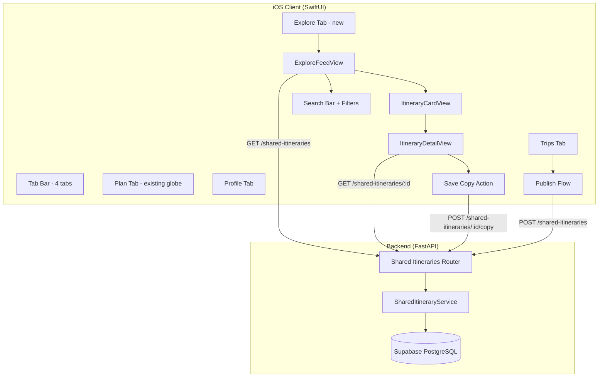

# Design Document: Explore Shared Itineraries

## Overview

This feature adds a curated library of user-published itineraries to the Orbi app, accessible via a new "Explore" tab in the bottom navigation. The existing globe/search screen is renamed to "Plan," creating a 4-tab layout: Plan, Explore, Trips, Profile. Users browse shared itineraries organized into curated sections (Featured, Trending, Browse by Destination, Browse by Budget Level), view full day-by-day detail, and save copies into their own My Trips for full editing. Users can also publish their own completed trips to the library with required metadata (cover photo, title, description, destination, budget level) and optional tags.

The backend introduces a new `shared_itineraries` table in Supabase PostgreSQL, new FastAPI endpoints for listing/searching/detail/save-copy/publish, and corresponding Pydantic models. The iOS client adds new SwiftUI views for the Explore feed, itinerary cards, detail view, search, and the publish flow.

This is explicitly not a social network — no followers, comments, DMs, or ephemeral content.

## Architecture



The architecture follows the existing patterns in the codebase:
- iOS: `@StateObject` ViewModels with `APIClient.shared.request()` calls, SwiftUI views using `DesignTokens` for theming
- Backend: FastAPI router → service layer → Supabase client, Pydantic models for request/response validation
- The new `shared_itineraries` table is independent from the existing `trips` and `shared_trips` tables

### Key Design Decisions

1. **Separate table from `shared_trips`**: The existing `shared_trips` table handles 1:1 share links for individual trips. The new `shared_itineraries` table is a public library with metadata, save counts, and featured flags — fundamentally different use case.

2. **Full itinerary snapshot in JSONB**: The `itinerary` column stores a complete copy of the trip's itinerary JSON at publish time. This decouples the shared version from future edits to the source trip.

3. **Save = deep copy into `trips` table**: When a user saves a shared itinerary, a new row is inserted into the existing `trips` table with full itinerary data, plus attribution metadata. The copied trip is fully editable using all existing trip editing functionality.

4. **No cascade delete on source_trip_id**: If the original trip is deleted, the shared itinerary remains in the library.

## Components and Interfaces

### iOS Components

#### Tab Bar Changes (ContentView.swift)

- Extend `AppTab` enum: `.plan`, `.explore`, `.trips`, `.profile`
- Rename existing `.explore` case to `.plan` (globe/search screen)
- Add new `.explore` case pointing to `ExploreFeedView`
- Default selected tab remains `.plan` (the globe)
- Update `FloatingTabBar` with 4 items: Plan (globe.americas.fill), Explore (square.grid.2x2), Trips (suitcase.fill), Profile (person.fill)

#### ExploreFeedView (new)

- `ExploreFeedViewModel`: `@MainActor ObservableObject`
  - `@Published sections: [ExploreSection]` — curated sections with itinerary cards
  - `@Published searchQuery: String`
  - `@Published durationFilter: ClosedRange<Int>?`
  - `@Published searchResults: [SharedItineraryCard]`
  - `@Published isLoading: Bool`, `@Published errorMessage: String?`
  - `func loadFeed() async` — fetches curated sections
  - `func search(query: String, duration: ClosedRange<Int>?) async` — searches itineraries
  - `func refresh() async` — pull-to-refresh

- View structure: search bar at top, vertical scroll of horizontal card rows per section. When search is active, switches to filtered flat list.

#### ItineraryCardView (new)

- Displays: cover photo (or gradient placeholder), title, destination, duration, budget indicator (dollar signs), creator username, save count with bookmark icon
- Tappable → navigates to `ItineraryDetailView`

#### ItineraryDetailView (new)

- `ItineraryDetailViewModel`: `@MainActor ObservableObject`
  - `@Published itinerary: SharedItineraryDetail?`
  - `@Published isSaving: Bool`, `@Published hasSaved: Bool`
  - `func loadDetail(id: String) async`
  - `func saveToMyTrips(id: String) async`

- View: cover photo, title, description, destination, budget indicator, creator username, day-by-day breakdown (reuses existing day/slot/meal card patterns from `SavedTripDetailView`), prominent "Save to My Trips" button

#### SharePublishView (new)

- `SharePublishViewModel`: `@MainActor ObservableObject`
  - `@Published coverPhotoURL: String`
  - `@Published title: String` (max 100 chars)
  - `@Published description: String` (max 500 chars)
  - `@Published destination: String`
  - `@Published budgetLevel: Int` (1-5)
  - `@Published selectedTags: Set<String>` (food, nightlife, outdoors, family)
  - `@Published isPublishing: Bool`, `@Published publishError: String?`
  - `func publish(tripId: String) async`
  - `var canSubmit: Bool` — validates all required fields and minimum quality

- Accessible from saved trip detail view via "Share to Explore" button
- Prompts for username creation if user has no username set

### Backend Components

#### Router: `routes/shared_itineraries.py`

| Method | Path | Auth | Description |
|--------|------|------|-------------|
| GET | `/shared-itineraries` | No | List/search shared itineraries (paginated) |
| GET | `/shared-itineraries/{id}` | No | Get full detail of a shared itinerary |
| POST | `/shared-itineraries/{id}/copy` | Yes | Copy shared itinerary to user's trips |
| POST | `/shared-itineraries` | Yes | Publish a trip as a shared itinerary |

Query parameters for GET list:
- `section`: `featured` | `trending` | `destination` | `budget` (optional)
- `destination`: string filter (case-insensitive partial match)
- `budget_level`: integer 1-5
- `min_days` / `max_days`: duration range filter
- `page` / `page_size`: pagination (default page_size=20)

#### Service: `services/shared_itineraries.py`

- `list_shared_itineraries(section, destination, budget_level, min_days, max_days, page, page_size)` — queries `shared_itineraries` table with filters, joins `users` for username
- `get_shared_itinerary(id)` — fetches single record with username join
- `copy_shared_itinerary(shared_id, user_id)` — creates a new `trips` row from the shared itinerary data, increments `save_count`, stores attribution
- `publish_shared_itinerary(user_id, trip_id, metadata)` — validates ownership, validates quality, creates `shared_itineraries` row

#### Models: `models/shared_itinerary.py`

- `SharedItineraryListItem` — card-level data (id, title, destination, num_days, budget_level, cover_photo_url, creator_username, save_count, tags)
- `SharedItineraryDetail` — full detail including itinerary JSONB
- `SharedItineraryPublishRequest` — publish metadata (cover_photo_url, title, description, destination, budget_level, tags)
- `SharedItineraryListResponse` — paginated list wrapper
- `SharedItineraryCopyResponse` — response after copy (new trip_id)

### iOS Models

#### New Swift models (in `Models/SharedItineraryModels.swift`)

```swift
struct SharedItineraryCard: Codable, Identifiable {
    let id: String
    let title: String
    let destination: String
    let numDays: Int
    let budgetLevel: Int
    let coverPhotoUrl: String?
    let creatorUsername: String
    let saveCount: Int
    let tags: [String]?
}

struct SharedItineraryDetail: Codable, Identifiable {
    let id: String
    let title: String
    let description: String
    let destination: String
    let destinationLatLng: String?
    let numDays: Int
    let budgetLevel: Int
    let coverPhotoUrl: String?
    let creatorUsername: String
    let saveCount: Int
    let tags: [String]?
    let itinerary: [String: AnyCodableValue]?
    let createdAt: String
}

struct ExploreSection: Codable, Identifiable {
    let id: String
    let title: String
    let sectionType: String
    let items: [SharedItineraryCard]
}

struct ExploreFeedResponse: Codable {
    let sections: [ExploreSection]
}

struct SharedItineraryPublishRequest: Encodable {
    let sourceTripId: String
    let coverPhotoUrl: String
    let title: String
    let description: String
    let destination: String
    let budgetLevel: Int
    let tags: [String]?
}

struct CopyResponse: Codable {
    let tripId: String
}
```

## Data Models

### Database: `shared_itineraries` table (Migration 006)

```sql
CREATE TABLE shared_itineraries (
    id UUID PRIMARY KEY DEFAULT uuid_generate_v4(),
    user_id UUID NOT NULL REFERENCES users(id) ON DELETE CASCADE,
    source_trip_id UUID REFERENCES trips(id) ON DELETE SET NULL,
    title TEXT NOT NULL CHECK (char_length(title) <= 100),
    description TEXT NOT NULL CHECK (char_length(description) <= 500),
    destination TEXT NOT NULL,
    destination_lat_lng TEXT,
    budget_level INTEGER NOT NULL CHECK (budget_level BETWEEN 1 AND 5),
    cover_photo_url TEXT NOT NULL,
    tags TEXT[] DEFAULT '{}',
    num_days INTEGER NOT NULL CHECK (num_days >= 1),
    itinerary JSONB NOT NULL,
    save_count INTEGER NOT NULL DEFAULT 0,
    is_featured BOOLEAN NOT NULL DEFAULT false,
    created_at TIMESTAMPTZ NOT NULL DEFAULT now(),
    updated_at TIMESTAMPTZ NOT NULL DEFAULT now()
);

-- Indexes
CREATE INDEX idx_shared_itineraries_destination ON shared_itineraries(destination);
CREATE INDEX idx_shared_itineraries_budget_level ON shared_itineraries(budget_level);
CREATE INDEX idx_shared_itineraries_save_count ON shared_itineraries(save_count DESC);
CREATE INDEX idx_shared_itineraries_is_featured ON shared_itineraries(is_featured) WHERE is_featured = true;
CREATE INDEX idx_shared_itineraries_user_id ON shared_itineraries(user_id);

-- Updated_at trigger
CREATE TRIGGER set_shared_itineraries_updated_at
    BEFORE UPDATE ON shared_itineraries
    FOR EACH ROW EXECUTE FUNCTION update_updated_at_column();
```

### Modified `trips` table columns (for attribution on copied trips)

Two new nullable columns on the existing `trips` table:

```sql
ALTER TABLE trips ADD COLUMN IF NOT EXISTS copied_from_shared_id UUID REFERENCES shared_itineraries(id) ON DELETE SET NULL;
ALTER TABLE trips ADD COLUMN IF NOT EXISTS original_creator_username TEXT;
```

### Data Flow: Publish

1. User taps "Share to Explore" on a saved trip
2. iOS sends `POST /shared-itineraries` with `source_trip_id` + metadata
3. Backend validates ownership, validates quality (≥1 day with ≥1 activity), validates metadata fields
4. Backend snapshots the trip's itinerary JSONB into `shared_itineraries.itinerary`
5. Returns the created shared itinerary ID

### Data Flow: Save/Copy

1. User taps "Save to My Trips" on a shared itinerary detail view
2. iOS sends `POST /shared-itineraries/{id}/copy`
3. Backend reads the shared itinerary, creates a new `trips` row with:
   - `itinerary` = shared itinerary's JSONB
   - `destination`, `num_days`, `vibe` from shared itinerary
   - `copied_from_shared_id` = shared itinerary ID
   - `original_creator_username` = creator's username
   - `user_id` = requesting user's ID
4. Backend increments `shared_itineraries.save_count` atomically
5. Returns the new trip ID

### Data Flow: Feed Sections

- **Featured**: `WHERE is_featured = true ORDER BY created_at DESC`
- **Trending**: `ORDER BY save_count DESC LIMIT 20`
- **Browse by Destination**: `GROUP BY destination`, return top destinations with their itineraries
- **Browse by Budget Level**: `GROUP BY budget_level`, return itineraries grouped by 1-5 scale


## Correctness Properties

*A property is a characteristic or behavior that should hold true across all valid executions of a system — essentially, a formal statement about what the system should do. Properties serve as the bridge between human-readable specifications and machine-verifiable correctness guarantees.*

### Property 1: Trending section is sorted by save count descending

*For any* set of shared itineraries returned in the Trending section, the itineraries SHALL be ordered by `save_count` in strictly non-increasing order (each item's save count is ≥ the next item's save count).

**Validates: Requirements 2.3**

### Property 2: Section grouping correctness

*For any* set of shared itineraries grouped into a "Browse by Destination" section, every itinerary within a destination group SHALL have a `destination` value matching that group's label. Similarly, *for any* "Browse by Budget Level" group, every itinerary within the group SHALL have a `budget_level` matching that group's value.

**Validates: Requirements 2.4, 2.5**

### Property 3: Budget indicator formatting

*For any* integer budget level `n` where `1 ≤ n ≤ 5`, the formatted budget indicator string SHALL consist of exactly `n` dollar sign characters and no other characters.

**Validates: Requirements 3.3**

### Property 4: Search filter correctness

*For any* search query string `q`, duration range `[min, max]`, and set of shared itineraries, every itinerary in the filtered results SHALL satisfy: (a) the itinerary's `destination` contains `q` as a case-insensitive substring, AND (b) the itinerary's `num_days` is within `[min, max]`. When only one filter is active, only that filter's condition applies.

**Validates: Requirements 4.2, 4.3, 4.4**

### Property 5: Copy preserves itinerary data and attribution

*For any* shared itinerary, when copied to a user's trips, the resulting trip SHALL contain: (a) an `itinerary` JSON structure identical to the original shared itinerary's structure (all days, time blocks, activity slots, and meal slots preserved), (b) `original_creator_username` matching the shared itinerary's creator username, and (c) `copied_from_shared_id` matching the shared itinerary's ID.

**Validates: Requirements 6.1, 6.2, 6.3**

### Property 6: Copy increments save count by exactly one

*For any* shared itinerary with an initial `save_count` of `N`, after a single successful copy operation, the shared itinerary's `save_count` SHALL equal `N + 1`.

**Validates: Requirements 6.4**

### Property 7: Publish validation rejects invalid metadata

*For any* publish request, the system SHALL reject the request if any of the following conditions hold: (a) `title` is empty or exceeds 100 characters, (b) `description` is empty or exceeds 500 characters, (c) `budget_level` is not an integer between 1 and 5 inclusive, (d) `cover_photo_url` is empty, (e) `destination` is empty. Valid requests satisfying all constraints SHALL be accepted.

**Validates: Requirements 7.2, 8.6, 11.2, 11.3, 11.4**

### Property 8: Quality gate rejects incomplete itineraries

*For any* itinerary structure, the publish quality check SHALL reject the itinerary if it does not contain at least one day with at least one activity slot. Itineraries with at least one day containing at least one activity slot SHALL pass the quality check.

**Validates: Requirements 7.4, 11.1**

### Property 9: Only trip owner can publish

*For any* user ID and trip ID combination, the publish operation SHALL succeed only when the user ID matches the `user_id` on the trip record. When the user ID does not match, the operation SHALL be rejected with an authorization error.

**Validates: Requirements 8.5**

## Error Handling

### iOS Client

| Scenario | Behavior |
|----------|----------|
| Explore feed fails to load | Show error message with "Retry" button (Req 2.7) |
| Itinerary detail fails to load | Show error alert with retry option |
| Save/copy fails | Show error alert with "Retry" button (Req 5.8) |
| Publish fails | Show error alert with "Retry" button (Req 7.7) |
| No search results | Show empty state message (Req 4.6) |
| Network offline | Show offline banner (existing `OfflineBannerView` pattern) |
| Cover photo fails to load | Show gradient placeholder (Req 3.2) |
| Username not set on publish | Prompt username creation before proceeding (Req 10.2) |

### Backend

| Scenario | HTTP Status | Response |
|----------|-------------|----------|
| Missing/invalid publish metadata | 422 | `{"detail": "field: validation message"}` (Req 8.7) |
| User doesn't own source trip | 403 | `{"detail": "You do not have access to this trip"}` |
| Shared itinerary not found | 404 | `{"detail": "Shared itinerary not found"}` |
| Trip not found for publish | 404 | `{"detail": "Trip not found"}` |
| Quality check fails (no activities) | 422 | `{"detail": "Trip must have at least one day with one activity"}` |
| Database error | 500 | `{"detail": "Internal server error"}` |

### Atomic Operations

- Save count increment uses Supabase's atomic `update` with SQL increment to prevent race conditions
- Copy operation creates the trip row and increments save count in sequence; if trip creation fails, save count is not incremented

## Testing Strategy

### Property-Based Tests (Python — using Hypothesis)

Property-based tests validate the correctness properties defined above. Each test runs a minimum of 100 iterations with randomly generated inputs.

- **Library**: [Hypothesis](https://hypothesis.readthedocs.io/) for Python backend tests
- **Minimum iterations**: 100 per property
- **Tag format**: `# Feature: explore-shared-itineraries, Property N: <title>`

Properties to implement as PBT:
1. Trending sort order — generate random itinerary lists, verify descending save_count
2. Section grouping — generate random itineraries, verify group membership
3. Budget indicator formatting — generate integers 1-5, verify dollar sign string
4. Search filter correctness — generate random queries + data, verify filter results
5. Copy data preservation — generate random itinerary structures, verify round-trip
6. Save count increment — generate random initial counts, verify +1
7. Publish validation — generate random metadata payloads, verify accept/reject
8. Quality gate — generate random itinerary structures, verify accept/reject
9. Ownership check — generate random user/trip pairs, verify authorization

### Unit Tests (Python — pytest)

- Specific examples for each API endpoint (happy path + error cases)
- Edge cases: empty feed, single itinerary, max pagination
- Validation error message formatting
- Username join behavior when username is null

### Unit Tests (Swift — XCTest)

- Tab bar configuration (4 tabs, correct order, correct icons)
- ItineraryCardView rendering with and without cover photo
- Budget indicator display formatting
- Detail view field rendering
- Publish form validation (client-side)
- Attribution display on copied trips

### Integration Tests (Python — pytest)

- Full publish flow: create trip → publish → verify shared_itineraries row
- Full copy flow: publish → copy → verify trips row + save_count increment
- Search with various filter combinations
- Pagination behavior
- Source trip deletion does not cascade to shared itinerary
- Username retrieval via user_id join
