# Design Document: Feature Enhancements

## Overview

This design covers 19 requirements spanning five categories for the Orbi iOS travel planning app: Smart Explore (GPS location, overlays, clustering, filters), Interactive Itinerary (drag-and-drop, AI replacement, optimize day, timeline bar), Route Intelligence (full-day optimization, ride-hail costs), Bug Fixes (restaurant selection, trips close button, profile name, share format), and UX Improvements (ratings source, price ranges, weather, design consistency, architecture patterns).

The system is a Swift/SwiftUI iOS client backed by a Python/FastAPI server. The iOS client uses MapKit for maps, `DesignTokens` for the dark glassmorphic design system, and `APIClient` for networking. The backend uses Supabase (Postgres), Redis caching, OpenAI for AI generation, and Foursquare/OpenAI for place recommendations.

All new features maintain the existing modular architecture: dedicated `ObservableObject` ViewModels on iOS, dedicated service modules on the backend, and the established dark gradient + glassmorphism visual language.

## Architecture

```mermaid
graph TB
    subgraph iOS Client
        LM[LocationManager] --> GV[GlobeView / ExploreMap]
        GV --> OC[OverlayCards]
        GV --> FP[FilterPills]
        GV --> MC[MarkerClustering]
        IE[ItineraryEditor] --> DnD[DragAndDrop]
        IE --> AIR[AI Replace]
        IE --> OD[OptimizeDay]
        IE --> TB[TimelineBar]
        MRV[MapRouteView] --> RI[RouteIntelligence]
        RI --> RHC[RideHailCost]
        RV[RecommendationsView] --> RS[RestaurantSelector]
        STV[SavedTripsView] --> CloseBtn[CloseFix]
        PT[ProfileTab] --> AuthName[AuthProfileName]
        STB[ShareTripButton] --> SF[ShareFormatter]
        PC[PlaceCard] --> RL[RatingLabel]
        PC --> PI[PriceIndicator]
        DFV[DestinationFlowView] --> DI[DestinationInsights]
    end

    subgraph Backend
        EO[/explore/overlays/] --> ExploreService
        PC2[/search/popular-cities?category/] --> SearchService
        WE[/destinations/weather/] --> WeatherService
        PlacesAPI[/places/hotels & restaurants/] --> PlaceService
        ItinAPI[/trips/generate & replace-item/] --> ItineraryService
    end

    GV -->|GET /explore/overlays| EO
    GV -->|GET /search/popular-cities| PC2
    DI -->|GET /destinations/weather| WE
    RL -->|rating_source, review_count| PlacesAPI
    PI -->|price_range_min, price_range_max| PlacesAPI
```



### Key Architectural Decisions

1. **GPS Location**: Use `CLLocationManager` wrapped in a dedicated `LocationManager` ObservableObject. Persist last known location in `UserDefaults`. Fallback chain: GPS → UserDefaults → New York default.

2. **Explore Overlays**: New backend endpoint `/explore/overlays` returns category-based overlay data. iOS renders up to 4 glassmorphic overlay cards. Graceful degradation on network failure (hide overlays).

3. **Map Clustering**: Use MapKit's `MKClusterAnnotation` via a `UIViewRepresentable` bridge (similar to existing `MapRouteOverlay`). The current SwiftUI `Map` `Annotation` approach doesn't support native clustering, so we switch to `MKMapView` for the explore map.

4. **Optimize Day Algorithm**: Client-side nearest-neighbor on coordinates. No backend call needed — the coordinates are already in the itinerary model. This keeps it fast and offline-capable.

5. **Ride-Hail Cost Estimation**: Pure formula-based calculation on the client side using distance from MapKit route segments. Formula: `baseFare + (distanceKm × perKmRate)` with city-specific rate tables.

6. **Weather Integration**: New backend endpoint `/destinations/weather` proxying a free weather API (Open-Meteo — no API key required). Cached with 1-hour TTL.

7. **Share Formatter**: Client-side plain text formatting. No backend changes needed — the trip data is already available on the client when sharing.

## Components and Interfaces

### iOS Components

#### 1. LocationManager (New)
```swift
@MainActor
final class LocationManager: NSObject, ObservableObject, CLLocationManagerDelegate {
    @Published var currentLocation: CLLocationCoordinate2D?
    @Published var authorizationStatus: CLAuthorizationStatus = .notDetermined
    
    func requestLocation()
    func persistLastKnown(_ coordinate: CLLocationCoordinate2D)
    func loadLastKnown() -> CLLocationCoordinate2D?
    static let defaultLocation = CLLocationCoordinate2D(latitude: 40.7128, longitude: -74.0060)
}
```

#### 2. ExploreOverlayViewModel (New)
```swift
@MainActor
final class ExploreOverlayViewModel: ObservableObject {
    @Published var overlays: [ExploreOverlay] = []
    @Published var isLoading: Bool = false
    
    func loadOverlays(latitude: Double, longitude: Double) async
}
```

#### 3. ExploreFilterViewModel (New)
```swift
@MainActor
final class ExploreFilterViewModel: ObservableObject {
    @Published var selectedCategory: ExploreCategory? = nil
    @Published var filteredCities: [CityMarker] = []
    
    func toggleFilter(_ category: ExploreCategory)
    func loadCities(category: ExploreCategory?) async
}
```

#### 4. ItineraryViewModel (Modified)
Add to existing `ItineraryViewModel`:
```swift
// Optimize Day (Req 7)
func optimizeDay(_ dayNumber: Int)

// Drag-and-drop already partially implemented via moveSlot/moveSlotToDay
```

#### 5. TimelineBarView (New)
```swift
struct TimelineBarView: View {
    let day: ItineraryDay
    let onSegmentTap: (String) -> Void  // "Morning", "Afternoon", "Evening"
}
```

#### 6. RouteIntelligenceViewModel (Modified MapRouteViewModel)
Extend existing `MapRouteViewModel`:
```swift
// Full-day optimization (Req 9)
var walkingTime: Int { /* sum of walking segments */ }
var drivingTime: Int { /* sum of driving segments */ }

// Ride-hail estimation (Req 10)
func estimateRideHailCost(segment: RouteSegment, city: String) -> ClosedRange<Double>
```

#### 7. ShareFormatter (New)
```swift
struct ShareFormatter {
    static func formatTrip(_ itinerary: ItineraryResponse) -> String
}
```

#### 8. WeatherViewModel (New)
```swift
@MainActor
final class WeatherViewModel: ObservableObject {
    @Published var weather: DestinationWeather?
    @Published var isLoading: Bool = false
    
    func loadWeather(latitude: Double, longitude: Double) async
}
```

### Backend Endpoints

#### GET `/explore/overlays`
- Query params: `latitude`, `longitude`
- Returns: `{ overlays: [{ category, title, destinations: [{ name, latitude, longitude }] }] }`
- Cached 6 hours

#### GET `/search/popular-cities?category=`
- New optional `category` query param on existing endpoint
- Filters cities by tagged category (Foodie, Adventure, Relaxation, Nightlife)

#### GET `/destinations/weather`
- Query params: `latitude`, `longitude`
- Returns: `{ temp_high, temp_low, condition, best_time_to_visit }`
- Proxies Open-Meteo API, cached 1 hour

#### Modified `/places/hotels` and `/places/restaurants`
- New optional response fields: `rating_source`, `review_count`, `price_range_min`, `price_range_max`
- All new fields are optional with defaults for backward compatibility

### Backend Services

#### WeatherService (New) — `backend/services/weather.py`
```python
async def get_weather(latitude: float, longitude: float) -> WeatherResponse
async def get_best_time_to_visit(latitude: float, longitude: float) -> str
```

#### ExploreService (New) — `backend/services/explore.py`
```python
async def get_overlays(latitude: float, longitude: float) -> list[ExploreOverlay]
```

## Data Models

### New iOS Models

```swift
// Explore Overlays
struct ExploreOverlay: Codable, Identifiable {
    let id: String
    let category: String       // "trending", "value", "popular", "weekend"
    let title: String
    let destinations: [OverlayDestination]
}

struct OverlayDestination: Codable {
    let name: String
    let latitude: Double
    let longitude: Double
}

// Explore Categories
enum ExploreCategory: String, CaseIterable, Identifiable {
    case foodie = "Foodie"
    case adventure = "Adventure"
    case relaxation = "Relaxation"
    case nightlife = "Nightlife"
    var id: String { rawValue }
}

// Weather
struct DestinationWeather: Codable {
    let tempHigh: Double
    let tempLow: Double
    let condition: String
    let bestTimeToVisit: String
}
```

### Modified iOS Models

```swift
// PlaceRecommendation — add optional fields (Req 15, 16)
struct PlaceRecommendation: Codable, Identifiable, Equatable {
    let placeId: String
    let name: String
    let rating: Double
    let priceLevel: String
    let imageUrl: String?
    let latitude: Double
    let longitude: Double
    // New fields
    let ratingSource: String?       // e.g. "Aggregated reviews"
    let reviewCount: Int?           // e.g. 142
    let priceRangeMin: Double?      // e.g. 150.0
    let priceRangeMax: Double?      // e.g. 300.0
}
```

### New Backend Models

```python
# backend/models/weather.py
class WeatherResponse(BaseModel):
    temp_high: float
    temp_low: float
    condition: str
    best_time_to_visit: str

# backend/models/explore.py
class OverlayDestination(BaseModel):
    name: str
    latitude: float
    longitude: float

class ExploreOverlay(BaseModel):
    category: str
    title: str
    destinations: list[OverlayDestination]

class ExploreOverlaysResponse(BaseModel):
    overlays: list[ExploreOverlay]
```

### Modified Backend Models

```python
# PlaceResult — add optional fields (Req 15, 16)
class PlaceResult(BaseModel):
    place_id: str
    name: str
    rating: float = 0.0
    price_level: str = ""
    image_url: str | None = None
    latitude: float = 0.0
    longitude: float = 0.0
    # New fields — optional for backward compatibility (Req 19.5)
    rating_source: str | None = None
    review_count: int | None = None
    price_range_min: float | None = None
    price_range_max: float | None = None
```

### Nearest-Neighbor Optimize Day Algorithm

```
function optimizeDay(slots: [ActivitySlot]) -> [ActivitySlot]:
    if slots.count < 3: return slots
    
    remaining = Set(slots)
    ordered = [remaining.removeFirst()]  // start with first slot
    
    while !remaining.isEmpty:
        current = ordered.last
        nearest = remaining.min(by: haversineDistance(current, $0))
        ordered.append(nearest)
        remaining.remove(nearest)
    
    return ordered
```

### Ride-Hail Cost Formula

```
baseFare = cityRateTable[city].baseFare ?? 3.0  // USD
perKmRate = cityRateTable[city].perKmRate ?? 1.5  // USD/km
distanceKm = segment.distanceMeters / 1000.0

lowEstimate = baseFare + (distanceKm * perKmRate * 0.8)
highEstimate = baseFare + (distanceKm * perKmRate * 1.5)

return lowEstimate...highEstimate
```

## Correctness Properties

*A property is a characteristic or behavior that should hold true across all valid executions of a system — essentially, a formal statement about what the system should do. Properties serve as the bridge between human-readable specifications and machine-verifiable correctness guarantees.*

### Property 1: Location persistence round-trip

*For any* valid GPS coordinate (latitude in -90...90, longitude in -180...180), persisting it via LocationManager to UserDefaults and then reading it back should produce the same coordinate values within floating-point tolerance.

**Validates: Requirements 1.5, 19.3**

### Property 2: Category filter returns only matching cities (client)

*For any* list of city markers with category tags and any selected ExploreCategory, filtering the list should return only cities whose category tag matches the selected category, and the result should be a subset of the original list.

**Validates: Requirements 4.2**

### Property 3: Category filter returns only matching cities (backend)

*For any* set of cities stored with category tags and any category query parameter, the `/search/popular-cities?category=X` endpoint should return only cities tagged with category X.

**Validates: Requirements 4.3**

### Property 4: Filter toggle round-trip restores original state

*For any* initial set of city markers and any ExploreCategory, toggling the filter on and then off should restore the city markers to the original unfiltered set.

**Validates: Requirements 4.4**

### Property 5: Intra-day reorder preserves all slots

*For any* day with N activity slots and any valid move operation (source index, destination index), after the move the day should still contain exactly N slots, all original slots should be present, and the moved slot should be at the destination index.

**Validates: Requirements 5.3**

### Property 6: Cross-day move transfers slot correctly

*For any* itinerary with multiple days and any activity slot in day A, moving it to day B should remove it from day A's slots and add it to day B's slots, with the total slot count across all days remaining unchanged.

**Validates: Requirements 5.4**

### Property 7: Replace activity prompt excludes all existing activities

*For any* list of existing activity names in an itinerary, the replacement prompt built by `_build_replace_prompt` should contain every activity name from the existing activities list in its exclusion section.

**Validates: Requirements 6.2**

### Property 8: Replace activity preserves slot index

*For any* day with activity slots and any slot at index I, replacing that slot should result in the new slot being at index I, the old slot being absent, and all other slots remaining unchanged.

**Validates: Requirements 6.3**

### Property 9: Nearest-neighbor optimization produces valid permutation with non-increasing total distance

*For any* list of 3 or more activity slots with valid coordinates, the optimize-day algorithm should produce a permutation of the original slots (same elements, same count) where the total haversine distance is less than or equal to the worst-case ordering.

**Validates: Requirements 7.2**

### Property 10: Optimize Day button disabled for fewer than 3 activities

*For any* day in an itinerary, the Optimize Day button should be disabled if and only if the day contains fewer than 3 activity slots.

**Validates: Requirements 7.5**

### Property 11: Timeline segment fill matches activity presence

*For any* itinerary day, a timeline segment (Morning, Afternoon, Evening) should be filled with its corresponding color if and only if at least one activity slot exists with that time slot label. Segments with no matching activities should be dimmed.

**Validates: Requirements 8.2, 8.3**

### Property 12: Route segment time aggregation is consistent

*For any* set of route segments with transport types, the total travel time should equal the sum of all individual segment travel times, and the sum of walking time plus driving time should also equal the total travel time.

**Validates: Requirements 9.2, 9.3**

### Property 13: Walking segments exceeding 30 minutes trigger driving alternative

*For any* route segment where the walking travel time exceeds 30 minutes, the Route Intelligence system should calculate and provide a driving route alternative for that segment.

**Validates: Requirements 9.4**

### Property 14: Ride-hail cost displayed for segments exceeding 15 minutes walking

*For any* route segment where walking time exceeds 15 minutes, a ride-hail cost range should be present. For segments with walking time ≤ 15 minutes, no ride-hail cost should be displayed.

**Validates: Requirements 10.1**

### Property 15: Ride-hail cost formula correctness

*For any* positive distance in kilometers and any city rate table entry (baseFare, perKmRate), the estimated ride-hail cost range should satisfy: lowEstimate = baseFare + distanceKm × perKmRate × 0.8 and highEstimate = baseFare + distanceKm × perKmRate × 1.5, with lowEstimate ≤ highEstimate.

**Validates: Requirements 10.2**

### Property 16: Restaurant selection toggle

*For any* restaurant in the recommendations list, selecting it should add it to selectedRestaurants with the correct placeId, and deselecting it (tapping again) should remove it from selectedRestaurants, restoring the previous state.

**Validates: Requirements 11.2, 11.4**

### Property 17: Auth stores display name from response

*For any* authentication response containing a display name, after successful authentication the AuthService's displayName published property should equal the name from the response.

**Validates: Requirements 13.6**

### Property 18: Share formatter produces correct structured plain text

*For any* valid ItineraryResponse with N days, the formatted share text should: (a) start with a title line matching the pattern "[numDays]-Day [destination] [vibe] Trip", (b) contain a header for each of the N days, and (c) include the restaurant name for every day that has a restaurant recommendation.

**Validates: Requirements 14.2, 14.3, 14.4**

### Property 19: User preferences persistence round-trip

*For any* set of user preferences (selected filters, last known location, default trip settings), persisting them to UserDefaults and reading them back should produce equivalent values.

**Validates: Requirements 19.3**

### Property 20: Backward-compatible deserialization with optional fields

*For any* backend response that omits the new optional fields (rating_source, review_count, price_range_min, price_range_max), deserialization into the PlaceResult/PlaceRecommendation model should succeed with nil/default values for the missing fields, and all existing fields should be preserved.

**Validates: Requirements 19.5**

## Error Handling

| Scenario | Behavior |
|---|---|
| Location permission denied | Fallback to UserDefaults last known location, then to New York default (Req 1.3, 1.4) |
| Explore overlays endpoint unreachable | Hide overlay cards, show map with markers only (Req 2.5) |
| Weather API unreachable | Display "Weather data unavailable" placeholder (Req 17.6) |
| AI activity replacement fails | Show error toast, retain original activity (Req 6.5) |
| MapKit route calculation fails for walking | Fallback to driving directions (existing behavior in MapRouteViewModel) |
| MapKit route calculation fails entirely | Skip segment silently, show available segments (existing behavior) |
| Backend returns response without new optional fields | Deserialize with nil defaults, UI hides unavailable data (Req 15.4, 16.4, 19.5) |
| Optimize Day on < 3 activities | Button disabled, no action (Req 7.5) |
| Share formatter receives empty itinerary | Produce minimal text with destination and "No activities planned" |

## Testing Strategy

### Unit Tests (Example-Based)

Unit tests cover specific scenarios, edge cases, and UI state management:

- **LocationManager**: Test fallback chain (GPS → UserDefaults → default), permission handling
- **ExploreOverlayViewModel**: Test loading states, error handling, empty response
- **FilterPills**: Test selection/deselection UI state, highlight toggling
- **ItineraryViewModel**: Test drag-and-drop state management, cost recalculation triggers
- **TimelineBarView**: Test segment rendering for various activity configurations
- **MapRouteViewModel**: Test route summary calculations, segment detail card data
- **RecommendationsViewModel**: Test restaurant selection state, highlight/checkmark toggling
- **ProfileTab**: Test name display with auth data, email fallback, navigation links
- **ShareFormatter**: Test output for edge cases (empty itinerary, single day, no restaurants)
- **WeatherViewModel**: Test loading states, error placeholder, temperature display
- **PlaceRecommendation deserialization**: Test backward compatibility with missing optional fields

### Property-Based Tests

Property-based tests validate universal correctness properties using generated inputs. Use Swift's `swift-testing` framework with a property testing library (e.g., `SwiftCheck` or custom generators) for iOS, and `hypothesis` for Python backend tests.

Each property test runs a minimum of 100 iterations and is tagged with its design property reference.

**iOS Property Tests:**
- Property 1: Location persistence round-trip — Tag: `Feature: feature-enhancements, Property 1: Location persistence round-trip`
- Property 2: Category filter client-side — Tag: `Feature: feature-enhancements, Property 2: Category filter returns only matching cities (client)`
- Property 4: Filter toggle round-trip — Tag: `Feature: feature-enhancements, Property 4: Filter toggle round-trip restores original state`
- Property 5: Intra-day reorder — Tag: `Feature: feature-enhancements, Property 5: Intra-day reorder preserves all slots`
- Property 6: Cross-day move — Tag: `Feature: feature-enhancements, Property 6: Cross-day move transfers slot correctly`
- Property 8: Replace preserves index — Tag: `Feature: feature-enhancements, Property 8: Replace activity preserves slot index`
- Property 9: Nearest-neighbor optimization — Tag: `Feature: feature-enhancements, Property 9: Nearest-neighbor optimization produces valid permutation`
- Property 10: Optimize button disabled — Tag: `Feature: feature-enhancements, Property 10: Optimize Day button disabled for fewer than 3 activities`
- Property 11: Timeline segment fill — Tag: `Feature: feature-enhancements, Property 11: Timeline segment fill matches activity presence`
- Property 12: Route time aggregation — Tag: `Feature: feature-enhancements, Property 12: Route segment time aggregation is consistent`
- Property 14: Ride-hail threshold — Tag: `Feature: feature-enhancements, Property 14: Ride-hail cost displayed for segments exceeding 15 minutes walking`
- Property 15: Ride-hail formula — Tag: `Feature: feature-enhancements, Property 15: Ride-hail cost formula correctness`
- Property 16: Restaurant selection toggle — Tag: `Feature: feature-enhancements, Property 16: Restaurant selection toggle`
- Property 18: Share formatter — Tag: `Feature: feature-enhancements, Property 18: Share formatter produces correct structured plain text`
- Property 19: Preferences persistence — Tag: `Feature: feature-enhancements, Property 19: User preferences persistence round-trip`
- Property 20: Backward-compatible deserialization — Tag: `Feature: feature-enhancements, Property 20: Backward-compatible deserialization with optional fields`

**Backend Property Tests (Python/Hypothesis):**
- Property 3: Category filter backend — Tag: `Feature: feature-enhancements, Property 3: Category filter returns only matching cities (backend)`
- Property 7: Replace prompt exclusion — Tag: `Feature: feature-enhancements, Property 7: Replace activity prompt excludes all existing activities`
- Property 17: Auth stores display name — Tag: `Feature: feature-enhancements, Property 17: Auth stores display name from response`

### Integration Tests

- Explore overlays endpoint: Verify response schema and caching behavior
- Weather endpoint: Verify Open-Meteo proxy returns correct schema
- Places endpoints: Verify new optional fields are included when available
- MapKit clustering: Verify MKClusterAnnotation configuration
- MapKit route calculation: Verify full-day route sequence

