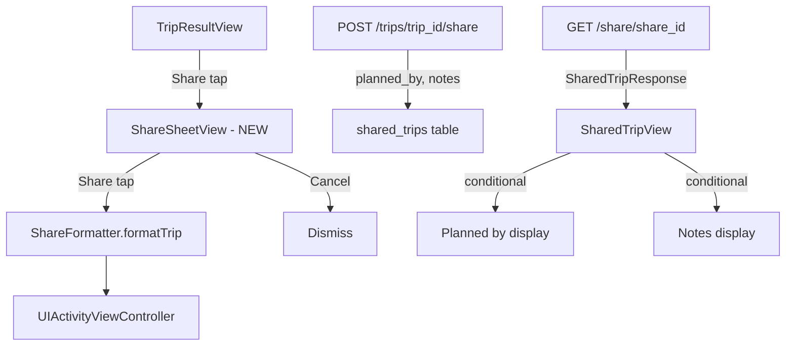

# Design Document: Share Flow Planner

## Overview

This design covers enhancements to the Orbi iOS travel app's share/export flow, adding lightweight planner functionality (optional "Planned by" and "Notes" fields), plus several bug fixes and UI cleanup tasks across the itinerary views.

The work spans three layers:

1. **iOS Share Flow** — New `ShareSheetView` modal with optional inputs, updated `ShareFormatter` output, and updated `SharedTripView` to conditionally render planner metadata.
2. **Backend** — Extend `SharedTripResponse` and the `shared_trips` table to store/return optional `planned_by` and `notes` fields.
3. **Bug Fixes & Cleanup** — Fix saved trip detail rendering, weather display on city selection, day section header clutter, and reasoning text truncation.

All changes are additive and scoped. The core Explore screen, itinerary generation, and navigation structure remain untouched.

## Architecture

The share flow enhancement follows the existing architecture patterns:



Key architectural decisions:

- **No new screens or navigation** — The `ShareSheetView` is a modal `.sheet` presented from `TripResultView`, replacing the direct `UIActivityViewController` invocation. No new tabs, feature flags, or mode toggles.
- **Session-scoped persistence for "Planned by"** — The value is held in a `@State` property on `TripResultView` and passed to `ShareSheetView`. It persists across multiple share sheet presentations within the same view lifecycle but is not written to disk or UserDefaults.
- **Backend fields are nullable** — `planned_by` and `notes` are optional columns on `shared_trips`. The existing share creation endpoint is extended to accept these fields; the read endpoint returns them.
- **ShareFormatter signature change** — `formatTrip` gains two optional parameters (`plannedBy: String?`, `notes: String?`) with default `nil` values, preserving backward compatibility.

## Components and Interfaces

### iOS Components

#### ShareSheetView (NEW)
A SwiftUI modal sheet presented when the user taps "Share" in `TripResultView`.

```swift
struct ShareSheetView: View {
    let itinerary: ItineraryResponse
    @Binding var plannedBy: String  // session-scoped, bound to TripResultView @State
    @State private var notes: String = ""
    @State private var showActivitySheet: Bool = false
    @Environment(\.dismiss) private var dismiss
}
```

- Displays trip title at top
- "Planned by (optional)" single-line `TextField`, max 100 chars
- "Add notes (optional)" multi-line `TextField`, max 500 chars, placeholder text, expands up to 4 lines
- "Share" button → formats text via `ShareFormatter.formatTrip` → presents `UIActivityViewController`
- "Cancel" button → dismisses sheet
- Uses `DesignTokens` colors and `.glassmorphic()` styling

#### ShareFormatter (MODIFIED)
Updated signature:

```swift
static func formatTrip(
    _ itinerary: ItineraryResponse,
    plannedBy: String? = nil,
    notes: String? = nil
) -> String
```

Output format when both fields are provided:
```
3-Day Tokyo Foodie Trip
Planned by [name]

Notes:
[user notes text]

Day 1:
  Tsukiji Outer Market (Morning) ($20)
  ...
```

When fields are empty/nil, those lines are omitted entirely.

#### SharedTripView (MODIFIED)
- Conditionally displays "Planned by [value]" below destination title in `DesignTokens.textSecondary` style
- Conditionally displays "Notes" section with heading and full text
- No visual gaps when fields are absent

#### SharedTripResponse (iOS model — MODIFIED)
Add two optional fields:

```swift
struct SharedTripResponse: Codable {
    // ... existing fields ...
    let plannedBy: String?
    let notes: String?
}
```

#### TripResultView (MODIFIED)
- Replace direct `UIActivityViewController` sheet with `ShareSheetView` presentation
- Add `@State private var plannedByText: String = ""` for session persistence
- Pass binding to `ShareSheetView`

#### SavedTripDetailView (MODIFIED — Req 10)
- Decode `itinerary` JSON into `ItineraryResponse` and render full day-by-day view
- Decode `costBreakdown` JSON into `CostBreakdown` and render cost section
- Show "No itinerary data available" when itinerary is null
- Show error with retry on load failure
- Display destination, duration, vibe in header

#### InlineDaySectionView.daySectionHeader (MODIFIED — Req 12)
Remove "Optimize" and standalone "Map" buttons. Keep: calendar icon, "Day N", spacer, "Apple Maps" button, activity count.

#### ItineraryView.daySectionHeader (MODIFIED — Req 12)
Same cleanup as InlineDaySectionView.

#### Why This Plan Card — TripResultView & ItineraryView (MODIFIED — Req 13)
Remove `.lineLimit(3)` from reasoning text to allow full display.

#### DestinationInsightsView / WeatherViewModel (Req 11)
The existing implementation already fetches weather via `.task` when the view appears with lat/lng. The fix ensures the `CityCardView` passes non-zero coordinates to `DestinationInsightsView`. If coordinates are already being passed correctly, this is a verification task.

### Backend Components

#### SharedTripResponse model (MODIFIED)

```python
class SharedTripResponse(BaseModel):
    # ... existing fields ...
    planned_by: str | None = None
    notes: str | None = None
```

#### ShareCreateRequest (NEW)

```python
class ShareCreateRequest(BaseModel):
    planned_by: str | None = Field(None, max_length=100)
    notes: str | None = Field(None, max_length=500)
```

#### share service — create_share_link (MODIFIED)
Accept optional `planned_by` and `notes` parameters. Store them in the `shared_trips` row. When empty strings are provided, store `null`.

#### share service — get_shared_trip (MODIFIED)
Return `planned_by` and `notes` from the `shared_trips` row in the response.

#### share route — POST /trips/{trip_id}/share (MODIFIED)
Accept `ShareCreateRequest` body. Pass fields to `create_share_link`.

#### Database migration (NEW)
Add `planned_by` and `notes` nullable text columns to `shared_trips` table.

## Data Models

### shared_trips table (extended)

| Column | Type | Nullable | Description |
|--------|------|----------|-------------|
| trip_id | uuid | NO | FK to trips.id |
| share_id | uuid | NO | Public share identifier |
| planned_by | text | YES | Optional planner name (max 100 chars) |
| notes | text | YES | Optional notes (max 500 chars) |

### ShareFormatter output structure

```
{title line}
[Planned by {name}]        ← only if plannedBy is non-empty
[                          ]
[Notes:                    ] ← only if notes is non-empty
[{notes text}              ]
[                          ]
Day 1:
  {activity} ({timeSlot}) [($cost)]
  🍽 {restaurant} - {cuisine} ({priceLevel})

...
[Estimated Total: ${total}] ← only if cost data exists
```


## Correctness Properties

*A property is a characteristic or behavior that should hold true across all valid executions of a system — essentially, a formal statement about what the system should do. Properties serve as the bridge between human-readable specifications and machine-verifiable correctness guarantees.*

### Property 1: Formatter output contains all required components

*For any* valid `ItineraryResponse` with at least one day and one activity with a non-zero cost, the output of `ShareFormatter.formatTrip` SHALL contain the trip title line (`"{numDays}-Day {destination} {vibe} Trip"`), a `"Day N:"` header for every day, every activity name, and an `"Estimated Total: $"` line.

**Validates: Requirements 5.1**

### Property 2: Planned-by line conditional inclusion

*For any* valid `ItineraryResponse` and any string `plannedBy`, if `plannedBy` is non-empty after trimming whitespace then the output of `ShareFormatter.formatTrip` SHALL contain `"Planned by {plannedBy}"`, and if `plannedBy` is nil or empty/whitespace-only then the output SHALL NOT contain the substring `"Planned by"`.

**Validates: Requirements 5.2, 5.3**

### Property 3: Notes section conditional inclusion

*For any* valid `ItineraryResponse` and any string `notes`, if `notes` is non-empty after trimming whitespace then the output of `ShareFormatter.formatTrip` SHALL contain `"Notes:"` followed by the notes text, and if `notes` is nil or empty/whitespace-only then the output SHALL NOT contain the substring `"Notes:"`.

**Validates: Requirements 5.4, 5.5**

### Property 4: Backend null normalization for empty planner fields

*For any* share creation request where `planned_by` or `notes` is an empty string or whitespace-only string, the backend SHALL store `null` for that field, and *for any* share creation request where the field is a non-empty non-whitespace string, the backend SHALL store the original value.

**Validates: Requirements 8.4**

### Property 5: Trip data serialization round-trip

*For any* valid `ItineraryResponse` object, encoding it to a `[String: AnyCodableValue]` dictionary and then decoding that dictionary back to an `ItineraryResponse` SHALL produce an object with equivalent `destination`, `numDays`, `vibe`, day count, and activity names. The same property holds for `CostBreakdown`.

**Validates: Requirements 10.2, 10.3**

### Property 6: Reasoning text is not truncated

*For any* `ItineraryResponse` with a non-empty `reasoningText` of arbitrary length, the Why This Plan card SHALL render the complete text without applying a line limit — meaning the displayed text content equals the full `reasoningText` value.

**Validates: Requirements 13.1, 13.2**

## Error Handling

| Scenario | Handling |
|----------|----------|
| Share link creation fails (network error) | `ShareTripViewModel` sets `errorMessage`, displayed as caption text below the share button. User can retry. |
| Share link resolution fails (404) | `SharedTripView` shows error with retry button. |
| Saved trip load fails | `SavedTripDetailView` shows error message with retry option (Req 10.5). |
| Weather API fails | `DestinationInsightsView` hides weather section silently — no error shown to user (Req 11.4). |
| `plannedBy` exceeds 100 chars | iOS `TextField` enforces `.onChange` truncation. Backend `max_length=100` validation rejects. |
| `notes` exceeds 500 chars | iOS `TextEditor` enforces `.onChange` truncation. Backend `max_length=500` validation rejects. |
| Itinerary JSON decode fails in SavedTripDetailView | Show "No itinerary data available" fallback (Req 10.4). |
| CostBreakdown JSON decode fails | Silently omit cost section. |

## Testing Strategy

### Unit Tests (Example-Based)

- **ShareSheetView**: Verify trip title display, field labels, placeholder text, button presence, cancel dismissal.
- **SharedTripView**: Verify conditional "Planned by" and "Notes" rendering with and without data.
- **SavedTripDetailView**: Verify header rendering, null itinerary fallback message, error + retry display.
- **Day section headers**: Verify "Optimize" and "Map" buttons are removed; only calendar icon, day text, Apple Maps button, and activity count remain.
- **Backend**: Verify `ShareCreateRequest` validation (max_length enforcement), null storage for empty strings.

### Property-Based Tests

Property-based tests use Swift's `swift-testing` framework with a custom property testing helper or the `SwiftCheck` library for iOS, and `hypothesis` for Python backend.

Each property test runs a minimum of 100 iterations.

- **Property 1** (Formatter completeness): Generate random `ItineraryResponse` with 1–14 days, 0–5 slots per day, random costs. Verify output contains title, all day headers, all activity names, and cost total.
  - Tag: `Feature: share-flow-planner, Property 1: Formatter output contains all required components`

- **Property 2** (Planned-by conditional): Generate random itineraries paired with random `plannedBy` strings (including nil, empty, whitespace, and non-empty). Verify presence/absence of "Planned by" line.
  - Tag: `Feature: share-flow-planner, Property 2: Planned-by line conditional inclusion`

- **Property 3** (Notes conditional): Same pattern as Property 2 for notes field.
  - Tag: `Feature: share-flow-planner, Property 3: Notes section conditional inclusion`

- **Property 4** (Backend null normalization): Generate random empty/whitespace and non-empty strings for `planned_by` and `notes`. Call `create_share_link`, verify stored values are null or original.
  - Tag: `Feature: share-flow-planner, Property 4: Backend null normalization for empty planner fields`

- **Property 5** (Serialization round-trip): Generate random `ItineraryResponse` and `CostBreakdown` objects, encode to dict, decode back, verify structural equivalence.
  - Tag: `Feature: share-flow-planner, Property 5: Trip data serialization round-trip`

- **Property 6** (Reasoning text): Generate random multi-line strings of varying length, set as `reasoningText`, verify the view renders the full text without truncation (no `.lineLimit`).
  - Tag: `Feature: share-flow-planner, Property 6: Reasoning text is not truncated`

### Integration Tests

- **Share flow end-to-end**: Create a share link with `planned_by` and `notes` via `POST /trips/{id}/share`, resolve via `GET /share/{share_id}`, verify fields are returned correctly.
- **Weather fetch**: Verify `WeatherViewModel.loadWeather` calls the correct endpoint with provided coordinates.
- **Saved trip load**: Verify `SavedTripsViewModel.loadTrip` fetches full trip data including itinerary and cost breakdown.
