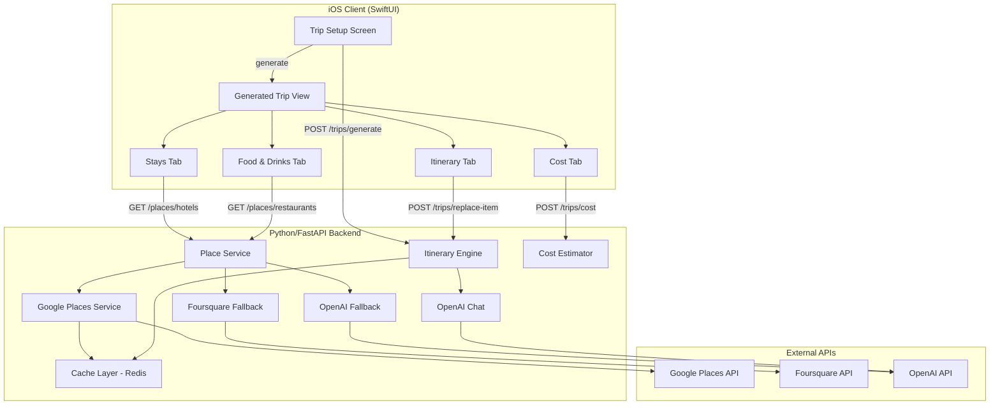
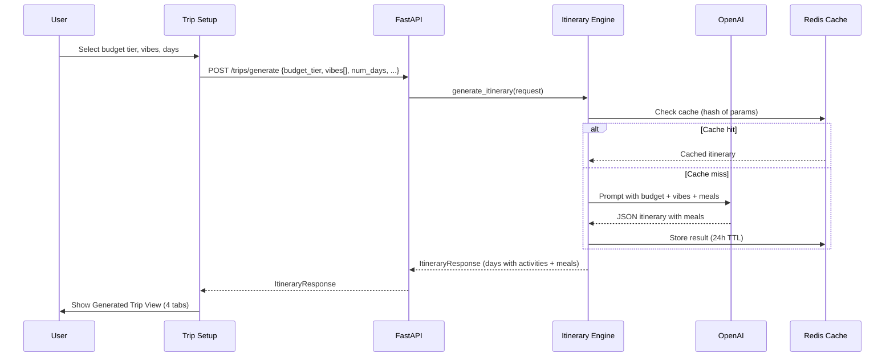
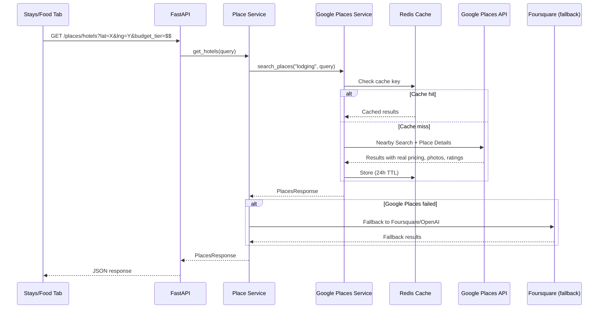

# Design Document: Trip Experience Redesign

## Overview

This design covers a major redesign of the Orbi travel app's trip planning flow. The changes span both the iOS client (Swift/SwiftUI) and the Python/FastAPI backend, touching trip setup, itinerary generation, place recommendations, and cost estimation.

The core philosophy is "generate first, customize second" — the app produces a complete itinerary with meals, hotels, and costs upfront, then lets users refine through dedicated tabs.

### Key Changes

1. **Trip Setup simplification**: Remove restaurant pre-selection, replace hotel preferences with a unified 5-tier budget selector, convert vibe to multi-select.
2. **4-tab Generated Trip View**: Replace the current 3-tab layout (Itinerary / Places / Cost) with 4 tabs (Itinerary / Stays / Food & Drinks / Cost).
3. **Itinerary with meals**: The itinerary engine now generates meals (Breakfast, Lunch, Dinner) as first-class items within time blocks alongside activities.
4. **Google Places API integration**: New backend service for verified hotel/restaurant data with real pricing, photos, and ratings. Cached via Redis with 24h TTL.
5. **Smart replace suggestions**: 3-5 contextual alternatives based on city, vibes, budget tier, and proximity.

### Files Affected

| Layer | File | Change |
|-------|------|--------|
| iOS | `ContentView.swift` | Remove `RestaurantSelector` from `PreferencesOverlay`, update `TripResultView` init |
| iOS | `DestinationFlowView.swift` | Replace `PriceRange`/`HotelVibe` with `BudgetTier`, convert `TripVibe` to multi-select |
| iOS | `TripResultView.swift` | 4-tab enum, new `StaysTab` and `FoodDrinksTab`, update tab picker |
| iOS | `ItineraryView.swift` | Add meal slots to time blocks, update item actions for meals |
| iOS | `RecommendationsView.swift` | Refactor into `StaysView.swift` (hotels only) |
| iOS | `CostBreakdownView.swift` | Add real vs estimated labels, update categories |
| iOS | `TripModels.swift` | New `BudgetTier`, `MealSlot`, updated request/response models |
| iOS | `RestaurantSelector.swift` | Delete (no longer used) |
| iOS | New `StaysView.swift` | Hotel selection with per-day assignment |
| iOS | New `FoodDrinksView.swift` | Meal refinement with alternatives |
| Backend | `models/itinerary.py` | Add `budget_tier`, `vibes` list, `MealSlot` model, update `ItineraryRequest` |
| Backend | `services/itinerary.py` | Rewrite prompt for meals + budget tier + multi-vibe, update replace logic |
| Backend | New `services/google_places.py` | Google Places API integration with caching |
| Backend | `services/places.py` | Add Google Places as primary source, Foursquare/OpenAI as fallback |
| Backend | `services/cost.py` | Support real pricing vs tier-based estimates, add `is_estimated` flag |
| Backend | `models/cost.py` | Add `is_estimated` field to cost items |
| Backend | `models/places.py` | Add Google Places fields (photos, hours, real pricing) |
| Backend | `routes/places.py` | Update to use Google Places service |
| Backend | `config.py` | Add `google_places_api_key` (already exists but unused) |

---

## Architecture

### System Architecture



### Data Flow — Trip Generation



### Data Flow — Google Places Integration



---

## Components and Interfaces

### iOS Components

#### 1. BudgetTier Enum (replaces PriceRange + HotelVibe)

```swift
enum BudgetTier: String, CaseIterable, Identifiable, Codable {
    case budget = "$"
    case casual = "$$"
    case comfortable = "$$$"
    case premium = "$$$$"
    case luxury = "$$$$$"

    var id: String { rawValue }

    var label: String {
        switch self {
        case .budget: return "Budget"
        case .casual: return "Casual"
        case .comfortable: return "Comfortable"
        case .premium: return "Premium"
        case .luxury: return "Luxury"
        }
    }
}
```

#### 2. TripVibe — Multi-Select

The existing `TripVibe` enum stays, but `TripPreferencesViewModel.selectedVibe: TripVibe` becomes `selectedVibes: Set<TripVibe>` with at-least-one validation.

#### 3. TripResultTab — 4 Tabs

```swift
enum TripResultTab: String, CaseIterable, Identifiable {
    case itinerary = "Itinerary"
    case stays = "Stays"
    case foodDrinks = "Food & Drinks"
    case cost = "Cost"

    var id: String { rawValue }
    var icon: String {
        switch self {
        case .itinerary: return "calendar"
        case .stays: return "building.2"
        case .foodDrinks: return "fork.knife"
        case .cost: return "dollarsign.circle"
        }
    }
}
```

#### 4. MealSlot Model

```swift
struct MealSlot: Codable, Identifiable, Equatable {
    var mealType: String        // "Breakfast", "Lunch", "Dinner"
    var restaurantName: String
    var cuisine: String
    var priceLevel: String
    var latitude: Double
    var longitude: Double
    var estimatedCostUsd: Double?
    var placeId: String?        // Google Places ID if from real data
    var isEstimated: Bool       // true if tier-based, false if real pricing

    var id: String { "\(mealType)-\(restaurantName)" }
}
```

#### 5. Updated ItineraryDay

```swift
struct ItineraryDay: Codable, Identifiable {
    let dayNumber: Int
    var slots: [ItinerarySlot]      // Activities
    var meals: [MealSlot]           // Meals (Breakfast, Lunch, Dinner)

    var id: Int { dayNumber }

    /// All items in chronological order for display
    var timeBlockItems: [TimeBlockItem] {
        // Merge slots and meals, sorted by time block order
    }
}
```

#### 6. StaysView

New view replacing the hotel section of `RecommendationsView`. Displays 3-5 hotel recommendations with:
- Single hotel for entire trip (default)
- Optional per-day hotel assignment
- Search fallback
- Triggers cost recalculation on selection change

#### 7. FoodDrinksView

New view showing all meals from the itinerary grouped by day/time block. Each meal shows:
- Current restaurant selection
- 3-5 alternative suggestions
- Search fallback
- Updates itinerary meal when alternative selected

### Backend Components

#### 1. Google Places Service (`services/google_places.py`)

New service file handling all Google Places API interactions.

```python
# Key functions:
async def search_nearby_places(
    place_type: str,          # "lodging" | "restaurant"
    latitude: float,
    longitude: float,
    radius: int = 5000,
    budget_tier: str | None = None,
    keyword: str | None = None,
) -> list[GooglePlaceResult]:
    """Search Google Places Nearby Search API with caching."""

async def get_place_details(place_id: str) -> GooglePlaceDetails:
    """Fetch detailed info (photos, hours, pricing) for a specific place."""
```

Cache key format: `gplaces:{type}:{hash(lat,lng,radius,budget,keyword)}`

#### 2. Updated Itinerary Engine

The prompt is rewritten to:
- Accept `budget_tier` instead of separate hotel/restaurant price ranges
- Accept `vibes: list[str]` instead of single `vibe: str`
- Generate meals (Breakfast, Lunch, Dinner) within time blocks
- Target 3-5 items per day (activities + meals), soft cap 6

#### 3. Updated Place Service (`services/places.py`)

Fallback chain: Google Places → Foursquare → OpenAI

```python
async def _search_places(place_type, query) -> PlacesResponse:
    # 1. Try Google Places (if API key configured)
    # 2. Fallback to Foursquare (if API key configured)
    # 3. Fallback to OpenAI generation
```

#### 4. Updated Cost Estimator

```python
class CostLineItem(BaseModel):
    category: str           # "hotel", "food", "activity"
    amount: float
    is_estimated: bool      # True if tier-based fallback
    source: str | None      # "google_places", "foursquare", "tier_estimate"
```

### API Interface Changes

#### POST /trips/generate — Updated Request

```json
{
    "destination": "Tokyo",
    "latitude": 35.6762,
    "longitude": 139.6503,
    "num_days": 5,
    "budget_tier": "$$$",
    "vibes": ["Foodie", "Adventure"],
    "family_friendly": false
}
```

Removed fields: `hotel_price_range`, `hotel_vibe`, `restaurant_price_range`, `cuisine_type`, `selected_restaurants`, `vibe` (singular).

#### POST /trips/generate — Updated Response

```json
{
    "destination": "Tokyo",
    "num_days": 5,
    "vibes": ["Foodie", "Adventure"],
    "budget_tier": "$$$",
    "reasoning_text": "...",
    "days": [
        {
            "day_number": 1,
            "slots": [
                {
                    "time_slot": "Morning",
                    "activity_name": "Tsukiji Outer Market",
                    "description": "...",
                    "latitude": 35.66,
                    "longitude": 139.77,
                    "estimated_duration_min": 120,
                    "travel_time_to_next_min": 15,
                    "estimated_cost_usd": 20,
                    "tag": "Popular"
                }
            ],
            "meals": [
                {
                    "meal_type": "Breakfast",
                    "restaurant_name": "Tsukiji Sushi Dai",
                    "cuisine": "Sushi",
                    "price_level": "$$$",
                    "latitude": 35.6655,
                    "longitude": 139.7710,
                    "estimated_cost_usd": 35,
                    "is_estimated": true
                },
                {
                    "meal_type": "Lunch",
                    "restaurant_name": "...",
                    "cuisine": "...",
                    "price_level": "$$$",
                    "latitude": 0.0,
                    "longitude": 0.0,
                    "estimated_cost_usd": 25,
                    "is_estimated": true
                },
                {
                    "meal_type": "Dinner",
                    "restaurant_name": "...",
                    "cuisine": "...",
                    "price_level": "$$$",
                    "latitude": 0.0,
                    "longitude": 0.0,
                    "estimated_cost_usd": 50,
                    "is_estimated": true
                }
            ]
        }
    ]
}
```

#### POST /trips/replace-item — Updated Request

```json
{
    "destination": "Tokyo",
    "day_number": 1,
    "time_slot": "Morning",
    "item_type": "activity",
    "current_item_name": "Tsukiji Outer Market",
    "existing_activities": ["Tsukiji Outer Market", "Senso-ji Temple"],
    "vibes": ["Foodie", "Adventure"],
    "budget_tier": "$$$",
    "adjacent_activity_coords": [{"lat": 35.66, "lng": 139.77}],
    "num_suggestions": 5
}
```

New fields: `item_type` ("activity" | "meal"), `vibes` (list), `budget_tier`, `num_suggestions`.

#### POST /trips/replace-item — Updated Response (Multiple Suggestions)

```json
{
    "suggestions": [
        {
            "time_slot": "Morning",
            "activity_name": "Meiji Shrine",
            "description": "...",
            "latitude": 35.67,
            "longitude": 139.69,
            "estimated_duration_min": 90,
            "estimated_cost_usd": 0,
            "tag": "Highly rated"
        }
    ]
}
```

Returns a list of 3-5 suggestions instead of a single replacement.

#### GET /places/hotels — Updated Query Params

Added: `budget_tier` (replaces `price_range` + `vibe`)

#### GET /places/restaurants — Updated Query Params

Added: `budget_tier` (replaces `price_range`)

---

## Data Models

### Backend Models

#### Updated `ItineraryRequest`

```python
class ItineraryRequest(BaseModel):
    destination: str
    latitude: float
    longitude: float
    num_days: int = Field(..., ge=1, le=14)
    budget_tier: str = Field(..., description="$, $$, $$$, $$$$, or $$$$$")
    vibes: list[str] = Field(..., min_length=1, description="One or more vibes")
    family_friendly: bool = False
```

#### New `MealSlot`

```python
class MealSlot(BaseModel):
    meal_type: str = Field(..., description="Breakfast, Lunch, or Dinner")
    restaurant_name: str
    cuisine: str
    price_level: str
    latitude: float
    longitude: float
    estimated_cost_usd: float = 0.0
    place_id: str | None = None
    is_estimated: bool = True
```

#### Updated `ItineraryDay`

```python
class ItineraryDay(BaseModel):
    day_number: int
    slots: list[ActivitySlot]
    meals: list[MealSlot] = Field(default_factory=list)
```

#### Updated `ItineraryResponse`

```python
class ItineraryResponse(BaseModel):
    destination: str
    num_days: int
    vibes: list[str]
    budget_tier: str
    days: list[ItineraryDay]
    reasoning_text: str | None = None
```

#### New `GooglePlaceResult`

```python
class GooglePlaceResult(BaseModel):
    place_id: str
    name: str
    rating: float = 0.0
    user_ratings_total: int = 0
    price_level: int | None = None      # 0-4 from Google
    price_level_display: str = ""       # Mapped to $-$$$$$
    photo_references: list[str] = Field(default_factory=list)
    latitude: float = 0.0
    longitude: float = 0.0
    formatted_address: str = ""
    opening_hours: dict | None = None
    # Real pricing (when available from Place Details)
    price_range_min: float | None = None
    price_range_max: float | None = None
    is_estimated: bool = True
```

#### Updated `ReplaceActivityRequest`

```python
class ReplaceActivityRequest(BaseModel):
    destination: str
    day_number: int
    time_slot: str
    item_type: str = Field("activity", description="'activity' or 'meal'")
    current_item_name: str
    existing_activities: list[str] = Field(default_factory=list)
    vibes: list[str] = Field(default_factory=list)
    budget_tier: str = ""
    adjacent_activity_coords: list[dict] | None = None
    num_suggestions: int = Field(5, ge=1, le=10)
```

#### New `ReplaceSuggestionsResponse`

```python
class ReplaceSuggestionsResponse(BaseModel):
    suggestions: list[ActivitySlot | MealSlot]
```

#### Updated `CostBreakdown` with Estimation Flags

```python
class DayCost(BaseModel):
    day: int
    hotel: float
    hotel_is_estimated: bool = True
    food: float
    food_is_estimated: bool = True
    activities: float
    subtotal: float

class CostBreakdown(BaseModel):
    hotel_total: float
    hotel_is_estimated: bool = True
    food_total: float
    food_is_estimated: bool = True
    activities_total: float
    total: float
    per_day: list[DayCost]
```

### iOS Models

#### Updated `TripPreferencesRequest`

```swift
struct TripPreferencesRequest: Encodable {
    let destination: String
    let latitude: Double
    let longitude: Double
    let numDays: Int
    let budgetTier: String          // "$" through "$$$$$"
    let vibes: [String]             // ["Foodie", "Adventure"]
    let familyFriendly: Bool
}
```

Removed: `hotelPriceRange`, `hotelVibe`, `restaurantPriceRange`, `cuisineType`, `selectedRestaurants`.

#### Updated `ItineraryResponse`

```swift
struct ItineraryResponse: Codable {
    let destination: String
    let numDays: Int
    let vibes: [String]
    let budgetTier: String
    var days: [ItineraryDay]
    var reasoningText: String?
}
```

#### Budget Tier Mapping (Backend)

| Tier | Hotel Nightly | Restaurant Per Person | Activity Budget/Day |
|------|--------------|----------------------|-------------------|
| $ (Budget) | $40-80 | $8-15 | $0-20 |
| $$ (Casual) | $80-150 | $15-30 | $20-50 |
| $$$ (Comfortable) | $150-250 | $30-50 | $50-100 |
| $$$$ (Premium) | $250-400 | $50-80 | $100-200 |
| $$$$$ (Luxury) | $400+ | $80+ | $200+ |


---

## Correctness Properties

*A property is a characteristic or behavior that should hold true across all valid executions of a system — essentially, a formal statement about what the system should do. Properties serve as the bridge between human-readable specifications and machine-verifiable correctness guarantees.*

### Property 1: Budget Tier Single Selection Invariant

*For any* sequence of budget tier selections on the Trip_Budget_Selector, exactly one tier shall be selected at any point in time, and the selected tier's `label` property shall return the correct human-readable string (Budget, Casual, Comfortable, Premium, or Luxury).

**Validates: Requirements 2.2, 2.3**

### Property 2: Multi-Vibe Selection Integrity

*For any* non-empty subset of TripVibe values selected by the user, the `selectedVibes` set shall contain exactly those vibes, and the encoded request body shall include all of them.

**Validates: Requirements 3.1, 3.6**

### Property 3: Itinerary Prompt Includes Budget and All Vibes

*For any* valid budget tier and any non-empty list of vibes, the prompt built by `_build_prompt` shall contain the budget tier string and reference every vibe in the list.

**Validates: Requirements 2.6, 3.7, 13.1, 13.2**

### Property 4: Generated Itinerary Completeness

*For any* valid ItineraryRequest (with budget tier and vibes), the generated ItineraryResponse shall have `num_days` days, each day shall contain at least one activity slot and at least one meal, and no day shall be empty.

**Validates: Requirements 1.3, 5.3, 5.5**

### Property 5: Items Per Day Within Bounds

*For any* generated ItineraryDay, the total number of items (activity slots + meals) shall be between 3 and 6 inclusive.

**Validates: Requirements 5.2, 13.4**

### Property 6: Meal-to-Time-Block Mapping

*For any* MealSlot in a generated itinerary, Breakfast shall map to Morning, Lunch shall map to Afternoon, and Dinner shall map to Evening.

**Validates: Requirements 5.4, 13.3**

### Property 7: Remove Activity Decreases Count

*For any* ItineraryDay with N slots and any slot in that day, calling `removeActivity` for that slot shall result in the day having exactly N-1 slots, and the removed slot shall not appear in the remaining slots.

**Validates: Requirements 6.4**

### Property 8: Replace Returns 3-5 Suggestions

*For any* valid ReplaceActivityRequest (for either activity or meal), the response shall contain between 3 and 5 suggestions, and none of the suggestion names shall appear in the `existing_activities` list.

**Validates: Requirements 6.2, 7.2, 14.1, 14.3**

### Property 9: Replace Prompt Includes Context

*For any* ReplaceActivityRequest with destination, vibes, budget_tier, and adjacent_activity_coords, the built prompt shall reference the destination city, all vibes, the budget tier, and the adjacent coordinates.

**Validates: Requirements 14.2**

### Property 10: Meal Grouping Round-Trip

*For any* ItineraryResponse, extracting all meals from all days and grouping them by (day_number, meal_type) shall produce the same set of meals as iterating through the original days' meal lists.

**Validates: Requirements 7.1**

### Property 11: Meal Replacement Updates Correct Position

*For any* itinerary, any day, and any meal in that day, selecting an alternative restaurant for that meal shall update only that specific meal's restaurant_name, cuisine, and pricing fields while preserving the meal_type and day_number.

**Validates: Requirements 7.3**

### Property 12: Hotel Selection Updates Cost

*For any* hotel selection with a known nightly rate, the Cost_Tab's hotel_total shall equal the nightly rate multiplied by num_days, and the total shall equal the sum of hotel_total + food_total + activities_total.

**Validates: Requirements 8.5, 9.2**

### Property 13: Cost Total Equals Sum of Categories

*For any* CostBreakdown, the `total` field shall equal `hotel_total + food_total + activities_total`, and each day's `subtotal` shall equal `hotel + food + activities` for that day.

**Validates: Requirements 9.1, 9.2**

### Property 14: Estimated Flag Reflects Data Source

*For any* cost line item, if the underlying price data came from Google Places API (real pricing), `is_estimated` shall be `false`. If the price was derived from tier-based fallback mapping, `is_estimated` shall be `true`.

**Validates: Requirements 9.3, 12.1, 12.2, 12.3**

### Property 15: Cache Key Determinism

*For any* two PlaceQuery objects with identical parameters (latitude, longitude, radius, price_range, vibe, cuisine), the generated cache key shall be identical. For any two PlaceQuery objects that differ in at least one parameter, the cache keys shall differ.

**Validates: Requirements 11.3**

### Property 16: Cache Round-Trip Preserves Data

*For any* PlacesResponse, storing it in the cache and retrieving it with the same key shall produce an equivalent PlacesResponse.

**Validates: Requirements 11.1, 11.2**

### Property 17: Google Places Price Mapping

*For any* GooglePlaceResult with a non-null `price_level` (0-4), the mapped `price_level_display` shall be a valid dollar-sign string ($-$$$$$), and if `price_range_min`/`price_range_max` are present, `is_estimated` shall be `false`.

**Validates: Requirements 10.2**

---

## Error Handling

### iOS Error Handling

| Scenario | Behavior |
|----------|----------|
| Itinerary generation fails | Show error banner with retry option. Stay on Trip Setup screen. |
| Replace suggestions fail | Show error toast. Keep current item unchanged. Offer manual search fallback. |
| Google Places / hotel fetch fails | Show "Unable to load hotels" with retry. Fall back to cached data if available. |
| Restaurant alternatives fail | Show "Unable to load alternatives" with retry. Keep current meal selection. |
| Cost calculation fails | Show "Cost unavailable" placeholder. Retry on next selection change. |
| Network offline | Show offline banner (existing). Disable generate/replace actions. Allow browsing cached data. |
| No vibes selected | Disable "Generate Itinerary" button. Show validation hint. |
| Invalid trip days (0 or >14) | Show inline validation error (existing behavior). |

### Backend Error Handling

| Scenario | Behavior | HTTP Status |
|----------|----------|-------------|
| OpenAI API failure | Log error, raise RuntimeError → 500 | 500 |
| Google Places API failure | Log warning, fall back to Foursquare/OpenAI | 200 (with fallback data) |
| Foursquare API failure | Log warning, fall back to OpenAI | 200 (with fallback data) |
| All place sources fail | Return empty results with `filters_broadened=true` | 200 |
| Invalid budget tier | Pydantic validation error | 422 |
| Empty vibes list | Pydantic validation error (min_length=1) | 422 |
| Redis cache failure | Log warning, use in-memory fallback (existing behavior) | 200 |
| JSON parse failure from OpenAI | Log error, raise RuntimeError → 500 | 500 |
| Google Places API key missing | Skip Google Places, use Foursquare/OpenAI | 200 |

### Fallback Chain for Place Data

```
Google Places API (primary)
    ↓ (on failure or missing API key)
Foursquare API (secondary)
    ↓ (on failure or missing API key)
OpenAI Generation (tertiary)
    ↓ (on failure)
Empty results with filters_broadened=true
```

---

## Testing Strategy

### Unit Tests

Unit tests cover specific examples, edge cases, and integration points:

**iOS:**
- `BudgetTier` enum has exactly 5 cases with correct raw values and labels
- `TripResultTab` enum has exactly 4 cases (Itinerary, Stays, Food & Drinks, Cost)
- `TripPreferencesRequest` encodes `budgetTier` and `vibes` array correctly
- `MealSlot` decodes from JSON with all fields including `isEstimated`
- `ItineraryDay.timeBlockItems` merges slots and meals in chronological order
- Default tab is `.itinerary` on `TripResultView` load
- `RestaurantSelector` is not referenced in `PreferencesOverlay`
- Per-day hotel assignment model supports different hotels per day

**Backend:**
- `_build_prompt` includes budget tier and all vibes in output string
- `_build_replace_prompt` includes city, vibes, budget, and adjacent coords
- `_parse_itinerary_response` correctly parses meals from JSON
- `calculate_cost` with `is_estimated` flags propagates correctly
- `_get_price_range` maps all 5 budget tiers to correct ranges
- Google Places fallback chain: Google → Foursquare → OpenAI
- Cache key generation is deterministic for identical inputs
- Empty vibes list rejected by Pydantic validation

### Property-Based Tests

Property-based tests use [Hypothesis](https://hypothesis.readthedocs.io/) (Python) and [SwiftCheck](https://github.com/typelift/SwiftCheck) or inline randomized tests (Swift) to verify universal properties across generated inputs. Each test runs a minimum of 100 iterations.

**Backend (Hypothesis):**

- **Property 1** (Budget Tier Single Selection): Generate random BudgetTier values, verify label mapping is bijective.
  Tag: `Feature: trip-experience-redesign, Property 1: Budget tier single selection invariant`

- **Property 3** (Prompt Includes Budget and Vibes): Generate random budget tiers and vibe lists, verify prompt contains all.
  Tag: `Feature: trip-experience-redesign, Property 3: Itinerary prompt includes budget and all vibes`

- **Property 5** (Items Per Day): Generate random ItineraryDay objects, verify item count is 3-6.
  Tag: `Feature: trip-experience-redesign, Property 5: Items per day within bounds`

- **Property 6** (Meal-to-Time-Block): Generate random MealSlots, verify mapping correctness.
  Tag: `Feature: trip-experience-redesign, Property 6: Meal-to-time-block mapping`

- **Property 7** (Remove Decreases Count): Generate random days with N slots, remove one, verify N-1.
  Tag: `Feature: trip-experience-redesign, Property 7: Remove activity decreases count`

- **Property 8** (Replace Suggestions): Generate random replace requests, verify 3-5 results with no duplicates from existing.
  Tag: `Feature: trip-experience-redesign, Property 8: Replace returns 3-5 suggestions`

- **Property 9** (Replace Prompt Context): Generate random replace requests, verify prompt includes all context fields.
  Tag: `Feature: trip-experience-redesign, Property 9: Replace prompt includes context`

- **Property 13** (Cost Total): Generate random CostBreakdown objects, verify total = sum of categories.
  Tag: `Feature: trip-experience-redesign, Property 13: Cost total equals sum of categories`

- **Property 14** (Estimated Flag): Generate random cost items with mixed sources, verify flag correctness.
  Tag: `Feature: trip-experience-redesign, Property 14: Estimated flag reflects data source`

- **Property 15** (Cache Key Determinism): Generate random PlaceQuery pairs, verify identical queries → identical keys, different queries → different keys.
  Tag: `Feature: trip-experience-redesign, Property 15: Cache key determinism`

- **Property 16** (Cache Round-Trip): Generate random PlacesResponse objects, cache and retrieve, verify equality.
  Tag: `Feature: trip-experience-redesign, Property 16: Cache round-trip preserves data`

- **Property 17** (Google Price Mapping): Generate random Google price_level values (0-4), verify dollar-sign mapping and is_estimated flag.
  Tag: `Feature: trip-experience-redesign, Property 17: Google Places price mapping`

**iOS (Randomized unit tests):**

- **Property 2** (Multi-Vibe Selection): Generate random vibe subsets, verify selectedVibes integrity.
  Tag: `Feature: trip-experience-redesign, Property 2: Multi-vibe selection integrity`

- **Property 10** (Meal Grouping Round-Trip): Generate random itineraries, verify meal extraction/grouping round-trip.
  Tag: `Feature: trip-experience-redesign, Property 10: Meal grouping round-trip`

- **Property 11** (Meal Replacement): Generate random itineraries and alternatives, verify correct position update.
  Tag: `Feature: trip-experience-redesign, Property 11: Meal replacement updates correct position`

- **Property 12** (Hotel Selection Updates Cost): Generate random hotel rates and trip lengths, verify cost calculation.
  Tag: `Feature: trip-experience-redesign, Property 12: Hotel selection updates cost`

### Integration Tests

- Google Places API returns valid hotel data with real pricing (1-2 calls)
- Fallback to Foursquare when Google Places key is missing
- Full trip generation flow: setup → generate → 4-tab view renders
- Replace activity flow returns suggestions and updates itinerary
- Cost recalculation after hotel selection change
