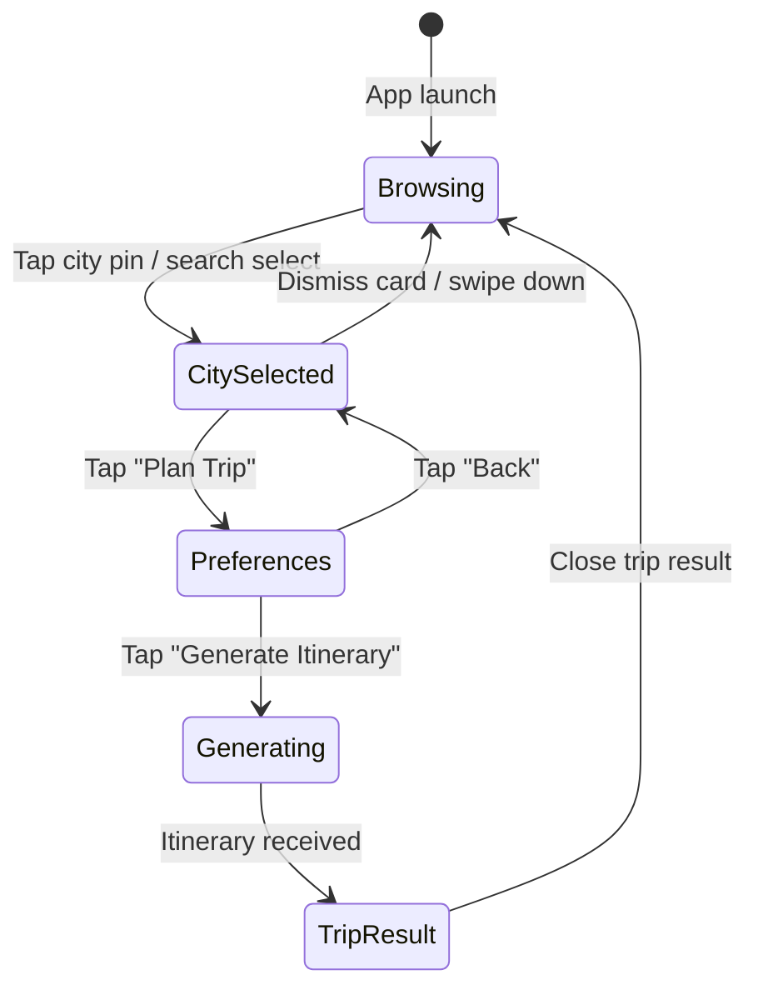
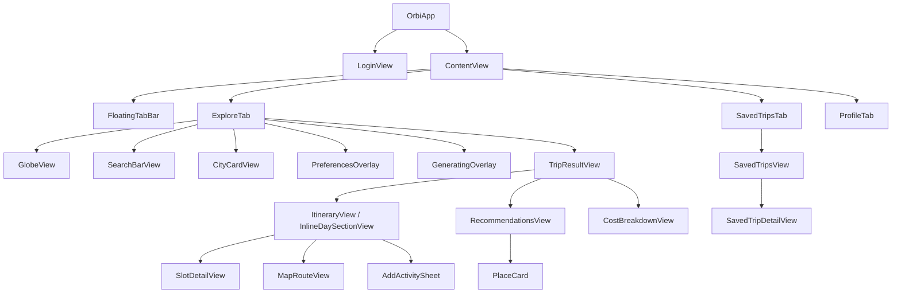

# Design Document: UI Redesign

## Overview

This design transforms the existing Orbi iOS SwiftUI app from its current light-themed, standard-component UI into a premium dark-space aesthetic with glassmorphism overlays, progressive-disclosure bottom sheets, and a floating tab bar. All backend logic, view models, and API integrations remain unchanged — only the view layer and styling are modified.

The redesign touches 10 existing SwiftUI view files plus introduces a shared `DesignTokens` module and a reusable `GlassmorphicCard` modifier. No new screens are added; every requirement maps to an existing file.

### Key Design Decisions

1. **Centralized Design Tokens** — A single `DesignTokens.swift` file defines all colors, spacing, corner radii, blur styles, and animation curves. Every view references these tokens instead of hardcoded values, ensuring consistency and easy iteration.
2. **Glassmorphism via ViewModifier** — A reusable `.glassmorphic()` modifier wraps `UIBlurEffect` + translucent fill + border, applied uniformly to cards, sheets, and the tab bar.
3. **Bottom Sheet State Machine in ContentView** — The existing `ExploreFlowState` enum already models `browsing → citySelected → preferences → generating`. The redesign keeps this state machine and reskins each state's overlay as a glassmorphic bottom sheet at the specified height fractions.
4. **No New Navigation Patterns** — The existing `NavigationStack`, `TabView`, `.sheet()`, and `.fullScreenCover()` patterns are preserved. Only visual styling changes.

## Architecture

### File-to-Screen Mapping

```
┌─────────────────────────────┬──────────────────────────────────────────┐
│ Existing File               │ Redesigned Screen / Component            │
├─────────────────────────────┼──────────────────────────────────────────┤
│ ContentView.swift           │ Floating TabBar, ExploreTab shell,       │
│                             │ CityCardView, PreferencesOverlay,        │
│                             │ GeneratingOverlay                        │
├─────────────────────────────┼──────────────────────────────────────────┤
│ GlobeView.swift             │ 3D globe with dark space background,     │
│                             │ star particles, satellite texture,       │
│                             │ glowing city pins, snap-to-city anim     │
├─────────────────────────────┼──────────────────────────────────────────┤
│ SearchBarView.swift         │ Floating glassmorphic search bar,        │
│                             │ autocomplete dropdown                    │
├─────────────────────────────┼──────────────────────────────────────────┤
│ DestinationFlowView.swift   │ (Kept as fallback; primary flow now      │
│                             │ handled by ContentView overlays)         │
├─────────────────────────────┼──────────────────────────────────────────┤
│ ItineraryView.swift         │ Trip Overview with day selector,         │
│                             │ dark-themed activity cards                │
├─────────────────────────────┼──────────────────────────────────────────┤
│ TripResultView.swift        │ Tabbed trip result (Itinerary, Hotels,   │
│                             │ Restaurants) with glassmorphic tabs      │
├─────────────────────────────┼──────────────────────────────────────────┤
│ MapRouteView.swift          │ Fullscreen map with gradient polyline,   │
│                             │ numbered markers, route summary card     │
├─────────────────────────────┼──────────────────────────────────────────┤
│ RecommendationsView.swift   │ Hotels/Restaurants tabs with dark cards  │
├─────────────────────────────┼──────────────────────────────────────────┤
│ SavedTripsView.swift        │ Dark grid/list of saved trips            │
├─────────────────────────────┼──────────────────────────────────────────┤
│ LoginView.swift             │ Dark space login with globe branding     │
└─────────────────────────────┴──────────────────────────────────────────┘
```

### New Files

| File | Purpose |
|------|---------|
| `Utilities/DesignTokens.swift` | Centralized colors, spacing, radii, animation curves |
| `Utilities/GlassmorphicModifier.swift` | Reusable `.glassmorphic()` ViewModifier |

### High-Level Flow



This state machine lives in `ContentView.swift` via the existing `ExploreFlowState` enum. No changes to the enum cases — only the visual presentation of each state changes.

## Components and Interfaces

### 1. DesignTokens (new: `Utilities/DesignTokens.swift`)

Centralizes all visual constants referenced by every view.

```swift
enum DesignTokens {
    // Colors
    static let backgroundPrimary = Color(red: 0.04, green: 0.06, blue: 0.14)
    static let backgroundSecondary = Color(red: 0.08, green: 0.10, blue: 0.20)
    static let surfaceGlass = Color.white.opacity(0.08)
    static let surfaceGlassBorder = Color.white.opacity(0.15)
    static let accentCyan = Color(red: 0.0, green: 0.85, blue: 0.95)
    static let accentBlue = Color(red: 0.2, green: 0.5, blue: 1.0)
    static let accentGradient = LinearGradient(
        colors: [accentCyan, accentBlue],
        startPoint: .leading, endPoint: .trailing
    )
    static let textPrimary = Color.white
    static let textSecondary = Color.white.opacity(0.6)
    static let textTertiary = Color.white.opacity(0.35)

    // Spacing
    static let spacingXS: CGFloat = 4
    static let spacingSM: CGFloat = 8
    static let spacingMD: CGFloat = 16
    static let spacingLG: CGFloat = 24
    static let spacingXL: CGFloat = 32

    // Corner Radii
    static let radiusSM: CGFloat = 12
    static let radiusMD: CGFloat = 16
    static let radiusLG: CGFloat = 24
    static let radiusXL: CGFloat = 28

    // Animation
    static let springResponse: Double = 0.4
    static let springDamping: Double = 0.85
    static let sheetSpring = Animation.spring(response: 0.4, dampingFraction: 0.85)
    static let globeTransition = Animation.easeInOut(duration: 1.2)
    static let pinScale = Animation.spring(response: 0.3, dampingFraction: 0.6)

    // Sizes
    static let tabBarHeight: CGFloat = 70
    static let searchBarHeight: CGFloat = 44
    static let cityCardFraction: CGFloat = 0.30
    static let preferencesSheetFraction: CGFloat = 0.80
}
```

### 2. GlassmorphicModifier (new: `Utilities/GlassmorphicModifier.swift`)

A reusable ViewModifier that applies the glassmorphism effect consistently.

```swift
struct GlassmorphicModifier: ViewModifier {
    var cornerRadius: CGFloat = DesignTokens.radiusLG
    func body(content: Content) -> some View {
        content
            .background(.ultraThinMaterial)
            .background(DesignTokens.surfaceGlass)
            .clipShape(RoundedRectangle(cornerRadius: cornerRadius))
            .overlay(
                RoundedRectangle(cornerRadius: cornerRadius)
                    .stroke(DesignTokens.surfaceGlassBorder, lineWidth: 0.5)
            )
    }
}

extension View {
    func glassmorphic(cornerRadius: CGFloat = DesignTokens.radiusLG) -> some View {
        modifier(GlassmorphicModifier(cornerRadius: cornerRadius))
    }
}
```

### 3. ContentView.swift — Floating Tab Bar

**Current:** Standard `TabView` with system tab bar.
**Redesigned:** Custom `ZStack`-based layout with a floating glassmorphic tab bar.

```
ZStack {
    // Selected tab content (full screen)
    switch selectedTab {
        case .explore: ExploreTab()
        case .trips:   SavedTripsTab()
        case .profile:  ProfileTab()
    }

    // Floating tab bar at bottom
    VStack {
        Spacer()
        FloatingTabBar(selectedTab: $selectedTab)
            .glassmorphic(cornerRadius: DesignTokens.radiusXL)
            .frame(height: DesignTokens.tabBarHeight)
            .padding(.horizontal, DesignTokens.spacingLG)
            .padding(.bottom, DesignTokens.spacingSM)
    }
}
.preferredColorScheme(.dark)
```

The `FloatingTabBar` is a new private struct inside ContentView that renders 3 tab buttons (Explore globe icon, Trips suitcase icon, Profile person icon) with small labels. The selected tab uses `DesignTokens.accentCyan` tint.

**Validates: Requirements 2.4, 2.5, 13.1, 13.2, 13.3, 13.4, 13.5**

### 4. ContentView.swift — CityCardView (Bottom Sheet ~30%)

**Current:** White card with shadow, `.fill(.white)` background.
**Redesigned:** Glassmorphic bottom sheet at 30% screen height with rounded top corners.

Changes:
- Background: `.glassmorphic()` instead of `.fill(.white)`
- Text colors: `DesignTokens.textPrimary` / `.textSecondary`
- "Plan Trip" button: `DesignTokens.accentGradient` background
- Add hero image placeholder (city image or gradient)
- Add rating display and country label
- Rounded top corners via `DesignTokens.radiusXL`
- Shadow: `Color.black.opacity(0.4)` for depth on dark background
- Slide-up with `DesignTokens.sheetSpring`

**Validates: Requirements 5.1, 5.2, 5.3, 5.4, 5.5, 5.6**

### 5. ContentView.swift — PreferencesOverlay (Bottom Sheet ~80%)

**Current:** White card overlay with system gray backgrounds.
**Redesigned:** Glassmorphic expanded sheet at 80% screen height.

Changes:
- Background: `.glassmorphic(cornerRadius: DesignTokens.radiusXL)`
- Vibe pills: Selected state uses `DesignTokens.accentGradient` fill; unselected uses outline with `DesignTokens.surfaceGlassBorder`
- Trip length: Stepper or horizontal picker with dark styling
- Hotel preferences: Segmented control with glass background
- "Generate Itinerary" button: Full-width with `DesignTokens.accentGradient`
- Spring animation from collapsed → expanded: `DesignTokens.sheetSpring`
- All text: white/secondary white

**Validates: Requirements 6.1, 6.2, 6.3, 6.4, 6.5, 6.6, 6.7**

### 6. ContentView.swift — GeneratingOverlay

**Current:** Black overlay with cyan globe icon and progress view.
**Redesigned:** Translucent dark overlay with glow pulse animation.

Changes:
- Background: `Color.black.opacity(0.5)` (globe visible behind)
- Center content: City name + "Generating your itinerary…" text
- Add pulsing glow effect: `Circle` with cyan radial gradient, opacity animating 0.3↔0.8 on repeat with `.easeInOut`
- Progress indicator: Custom pulsing ring or system `ProgressView` with cyan tint

**Validates: Requirements 7.1, 7.2, 7.3, 7.4**

### 7. GlobeView.swift — Dark Space Background & City Pins

**Current:** Dark background (`UIColor(red: 0.04, green: 0.06, blue: 0.14)`), blue pin dots, 2D label overlays.
**Redesigned:**

- **Background:** Add star particle layer (small white dots at random positions with varying opacity) behind the earth node in `GlobeScene.create()`
- **Earth texture:** Keep existing satellite texture; increase emission intensity slightly for richer look
- **City pins:** Change from blue dots to glowing cyan dots with `SCNMaterial.emission` set to cyan. Add fade-in based on zoom level (pins hidden when `camera.position.z > 3.0`, visible when closer)
- **Pin tap:** Add scale-up spring animation on the pin node before triggering city selection. Add `UIImpactFeedbackGenerator(style: .medium)` on tap
- **Snap-to-city:** Keep existing `animateZoomToCity` but use `DesignTokens.globeTransition` duration (1.2s ease-in-out)
- **2D labels:** Restyle with glassmorphic pill background instead of plain text shadow

**Validates: Requirements 1.1, 1.5, 3.1, 3.2, 3.3, 3.4, 3.5, 3.6, 4.1, 4.2, 4.3**

### 8. SearchBarView.swift — Floating Glassmorphic Search

**Current:** Semi-transparent white background with rounded corners.
**Redesigned:**

- Background: `.glassmorphic(cornerRadius: DesignTokens.radiusMD)`
- Height: `DesignTokens.searchBarHeight` (44pt)
- Placeholder: "Search destinations…" in `DesignTokens.textTertiary`
- Icons: White with 0.6 opacity
- Suggestions dropdown: `.glassmorphic()` background, dark-themed rows
- Position: Top safe area, `padding(.top, 8)`

**Validates: Requirements 2.1, 2.2, 2.3**

### 9. TripResultView.swift / ItineraryView.swift — Trip Overview

**Current:** System grouped background, orange accent, standard list styling.
**Redesigned:**

- Background: `DesignTokens.backgroundPrimary`
- Header: Trip name + dates in white text
- Day selector: Horizontal `ScrollView` of pill buttons. Selected day uses `DesignTokens.accentGradient` fill; unselected uses glass outline
- Activity cards: Dark cards with `DesignTokens.radiusMD` corners, image thumbnail, title, rating stars, description. Each card uses `.glassmorphic(cornerRadius: DesignTokens.radiusMD)`
- Inline mini map: Small `Map` view clipped to rounded rect inside each activity card
- Timeline indicator: Keep existing dot + line pattern, use cyan/blue/purple for time slots

**Validates: Requirements 8.1, 8.2, 8.3, 8.4, 8.5, 8.6**

### 10. MapRouteView.swift — Fullscreen Map

**Current:** Standard MapKit with orange polylines and marker annotations.
**Redesigned:**

- Polyline: Blue gradient style (use `MKGradientPolylineRenderer` or solid blue `DesignTokens.accentBlue`)
- Markers: Numbered circle markers (1, 2, 3…) instead of default pins. Use custom `MKAnnotationView` with numbered circle
- Route summary card: Glassmorphic card at bottom showing total distance + total time
- Stop list: Scrollable horizontal list below the map showing place name, rating, distance to next

**Validates: Requirements 9.1, 9.2, 9.3, 9.4, 9.5, 9.6**

### 11. RecommendationsView.swift — Hotels & Restaurants

**Current:** System grouped list with orange accents.
**Redesigned:**

- Tab bar: Glassmorphic segmented control with "Itinerary", "Hotels", "Restaurants" labels
- Cards: Dark glassmorphic cards with image, name, rating, price level
- Refresh button: Styled with glass background
- All text: White primary/secondary

**Validates: Requirements 10.1, 10.2, 10.3, 10.4**

### 12. SavedTripsView.swift — Saved Trips Grid

**Current:** System `List` with inset grouped style.
**Redesigned:**

- Layout: 2-column `LazyVGrid` with glassmorphic cards
- Each card: City image (placeholder gradient), trip name, dates
- Background: `DesignTokens.backgroundPrimary`
- Card corners: `DesignTokens.radiusMD`
- Tap navigates to Trip Overview

**Validates: Requirements 11.1, 11.2, 11.3, 11.4**

### 13. LoginView.swift — Dark Space Login

**Current:** Already dark-themed with orange gradient. Mostly aligned with redesign.
**Redesigned:**

- Keep existing dark background and radial glow
- Update accent from orange to cyan gradient to match new design language
- Sign-in buttons: Add glassmorphic outline style
- Branding icon: Keep globe, update gradient to cyan

Minor changes only — this view is already close to the target aesthetic.

## Component Hierarchy Diagram



## Data Models

No data model changes are required. All existing models (`CityMarker`, `ItineraryResponse`, `ItineraryDay`, `ItinerarySlot`, `PlaceRecommendation`, `TripListItem`, `TripResponse`, etc.) remain unchanged.

The only new "model" is the `DesignTokens` enum which holds static constants — it has no stored state.

The `ExploreFlowState` enum in ContentView remains:
```swift
enum ExploreFlowState: Equatable {
    case browsing, citySelected, preferences, generating
}
```

## Error Handling

No changes to error handling logic. All existing error states (network errors, API errors, validation errors) remain as-is. The visual presentation of error messages updates to use dark-theme styling:

- Error text: `Color.red.opacity(0.9)` on dark backgrounds
- Error banners: Glassmorphic card with red accent border
- Retry buttons: Styled with `DesignTokens.accentGradient`
- Alert dialogs: System alerts (unchanged, they respect `.preferredColorScheme(.dark)`)

## Testing Strategy

Since this is a UI redesign with no business logic changes, property-based testing is not applicable. The feature involves UI rendering, layout, styling, and animation — all of which are best validated through visual inspection and snapshot testing.

**Why PBT does not apply:** This feature modifies SwiftUI view styling (colors, spacing, blur effects, animations). There are no pure functions with varying input/output behavior to test with universal properties. The acceptance criteria describe visual appearance and animation behavior, not data transformations.

**Recommended testing approach:**

- **Snapshot tests:** Use `swift-snapshot-testing` to capture rendered views in dark mode and compare against baseline images. Cover each major screen: Login, Explore (browsing, city selected, preferences, generating), Trip Overview, Map Route, Recommendations, Saved Trips.
- **SwiftUI Preview verification:** Each view file already has `#Preview` blocks. Update these to reflect the new dark styling and verify visually in Xcode Canvas.
- **Manual QA checklist:**
  - Glassmorphism blur renders correctly on all screen sizes
  - Bottom sheet heights match 30% / 80% fractions
  - Floating tab bar stays above safe area on all devices
  - Globe star particles render without performance issues
  - City pin fade-in/out works at correct zoom thresholds
  - Spring animations feel smooth (no jank at 60fps)
  - Haptic feedback fires on city pin tap
  - Dark mode colors pass WCAG contrast ratios for text readability
- **Unit tests for DesignTokens:** Simple assertions that token values are within expected ranges (e.g., corner radii between 12–28, animation durations between 0.3–1.5s). These are example-based, not property-based.
- **Accessibility audit:** Verify VoiceOver labels remain correct after restyling. Ensure contrast ratios meet minimum 4.5:1 for body text against dark backgrounds.
