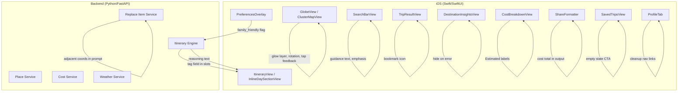

# Design Document: UX Polish Enhancements

## Overview

This design covers a targeted UX polish pass across the Orbi iOS travel app and its Python/FastAPI backend. The 22 requirements span UI cleanup (vibe chips, profile, pricing), new micro-features (family-friendly toggle, Apple Maps deep link, activity tags, haptics), visual enhancements (globe glow, rotation, tap feedback, search bar emphasis), and quality-of-life improvements (weather fix, bookmark UX, empty states, loading messages, cost clarity, export upgrade, guidance text).

The changes are intentionally scoped to avoid new architectural systems. Most work is SwiftUI view-layer modifications, with targeted backend prompt and model changes for family-friendly filtering, activity tags, and itinerary reasoning.

### Design Decisions

1. **Globe enhancements use MKMapCamera animation, not SceneKit** — The existing `ClusterMapView` is an `MKMapView` UIViewRepresentable with `satelliteFlyover`. Globe rotation is achieved by animating `camera.heading` via a repeating timer in the Coordinator, not by introducing a new rendering layer.

2. **Globe glow is a SwiftUI overlay behind the map** — A `RadialGradient` view is placed in the ZStack behind `ClusterMapView` rather than modifying the map view itself, keeping the UIKit bridge clean.

3. **Family-friendly is a prompt modifier, not a filter system** — The toggle adds a constraint string to the OpenAI prompt. No new database tables or filtering infrastructure is needed.

4. **Activity tags come from the AI response** — The backend prompt requests a `tag` field per activity slot. The iOS model adds an optional `tag` property. No separate tagging service is introduced.

5. **Bookmark replaces Save button entirely** — The existing `saveTrip()` logic is reused but triggered from a toolbar bookmark icon with filled/unfilled states, removing the modal confirmation dialog.

6. **Pricing display uses fallback tiers** — When `priceRangeMin`/`priceRangeMax` are nil, the UI maps the `priceLevel` string to hardcoded numeric ranges. No new API calls are needed.

7. **Auto-optimization runs client-side** — The existing `optimizeDay()` nearest-neighbor algorithm in `ItineraryViewModel` is called automatically on itinerary load for days with ≥3 activities.

## Architecture

The changes follow the existing architecture without introducing new layers:



### Change Scope by Layer

| Layer | Files Modified | Nature of Change |
|-------|---------------|-----------------|
| iOS Views | GlobeView, SearchBarView, ContentView, ItineraryView, TripResultView, CostBreakdownView, SavedTripsView, DestinationInsightsView, DestinationFlowView, RecommendationsView | UI layout, styling, new subviews |
| iOS Models | TripModels, DestinationModels | Add optional fields (tag, reasoning, familyFriendly) |
| iOS Utilities | ShareFormatter, DesignTokens | Format upgrade, new tokens |
| Backend Models | itinerary.py | Add tag, reasoning_text, family_friendly fields |
| Backend Services | itinerary.py | Prompt modifications for family-friendly, tags, reasoning |

## Components and Interfaces

### 1. Interest Builder Vibe Chip Cleanup (Req 1)

**Current:** Vibe chips appear both in `GlobeView` filter pills row and in `PreferencesOverlay`.
**Change:** Remove the `ExploreCategory` filter pills from `GlobeView.filterPillsRow`. In `PreferencesOverlay`, replace the horizontal `HStack` of vibe pills with a wrapping `FlowLayout` that supports multi-line wrapping with 8pt spacing and 16pt horizontal / 9pt vertical padding per chip.

**Component:** New `FlowLayout` ViewBuilder helper (or use SwiftUI `Layout` protocol) in `DesignTokens.swift` or a new `FlowLayout.swift` utility.

### 2. Family Friendly Toggle (Req 2)

**iOS:** Add a `Toggle` below the vibe section in `PreferencesOverlay`. Bind to `TripPreferencesViewModel.familyFriendly: Bool = false`. Pass the flag in `TripPreferencesRequest`.

**Backend:** `ItineraryRequest` gains `family_friendly: bool = False`. `_build_prompt()` appends: `"Family-friendly mode: prioritize parks, museums, zoos, cultural centers. Reduce nightlife and adult venues.\n"` when true.

### 3. City Selection Weather Fix (Req 3)

**Current:** `DestinationInsightsView` shows "Weather data unavailable" text on error.
**Change:** When `weatherVM.errorMessage != nil`, render `EmptyView()` instead of the error text block. The entire weather section is hidden on failure.

### 4. Profile Page Cleanup (Req 4)

**Current:** `ProfileTab` shows "Traveler" fallback, Settings, Preferences, Notifications, Appearance links.
**Change:** Remove the "Orbi Explorer" subtitle. Display `authService.displayName ?? authService.userId ?? "User"` (never "Traveler"). Remove Settings, Preferences, Notifications, Appearance `NavigationLink`s. Keep only: Saved Trips, My Trips (switches to Trips tab), Sign Out.

### 5–6. Hotel & Restaurant Pricing Display (Req 5, 6)

**Current:** `PlaceCard` shows `place.priceLevel` as raw `$`/`$$` strings.
**Change:** Add computed properties or helper functions:
- Hotels: If `priceRangeMin`/`priceRangeMax` available, show `"$XXX / night avg"` using the average. Otherwise map `priceLevel` → `$80`, `$150`, `$250` and display `"$XXX / night avg"`.
- Restaurants: If `priceRangeMin`/`priceRangeMax` available, show `"$XX–$XX per person"`. Otherwise map `priceLevel` → `$10–$20`, `$20–$40`, `$40–$80`.

### 7. Itinerary Auto-Optimization (Req 7)

**Current:** User manually taps "Optimize" per day.
**Change:** In `ItineraryViewModel.init()` or on first appearance, iterate all days and call `optimizeDay()` for days with ≥3 slots. Add a `reasoningMicrocopy` string displayed at the top of the itinerary: "Optimized for minimal travel time and best experience flow".

### 8. Apple Maps Deep Link (Req 8)

**New:** Add an "Open in Apple Maps" button in `InlineDaySectionView.daySectionHeader`. On tap, construct a `maps://` URL with waypoints from the day's slot coordinates and open via `UIApplication.shared.open()`.

URL format: `https://maps.apple.com/?daddr=LAT,LNG&dirflg=w` for single destination, or chain waypoints using `MKMapItem.openMaps(with:launchOptions:)` for multi-stop routes.

### 9. Itinerary Reasoning Section (Req 9)

**Backend:** `ItineraryResponse` gains `reasoning_text: str | None = None`. The prompt requests a `"reasoning"` field in the JSON schema. `_parse_itinerary_response` extracts it.

**iOS:** `ItineraryResponse` gains `reasoningText: String?`. Display a "Why This Plan" card at the top of the itinerary tab with the reasoning text.

### 10. Bookmark Save UX (Req 10)

**Current:** `TripResultView` toolbar has a "Save" button with label and a success alert dialog.
**Change:** Replace with a `bookmark` / `bookmark.fill` SF Symbol icon. Tap toggles save state. Remove the `showSaveSuccess` alert. On load, check if trip is already saved (match destination + numDays + vibe) and show filled icon.

### 11. Replace Item Logic Validation (Req 11)

**Current:** `ReplaceActivityRequest` sends destination, dayNumber, timeSlot, currentActivityName, existingActivities, vibe.
**Change:** Add `adjacent_activity_coords: list[dict]` to the request model. The iOS client populates this with lat/lng of the previous and next activities in the same day. The backend prompt includes: `"The replacement must be within 60 minutes travel of these coordinates: {coords}"`.

### 12. Trips Tab Empty State (Req 12)

**Current:** `SavedTripsView` shows "No saved trips yet" with generic text.
**Change:** Show "No trips yet" heading, a "Plan your first trip" button that switches to the Explore tab, and a suggestion line like "Try a weekend in Atlanta". The button triggers tab navigation via a callback or `@Environment` binding.

### 13. Export Share Upgrade (Req 13)

**Current:** `ShareFormatter.formatTrip()` outputs title, day activities, and restaurant names.
**Change:** Add estimated cost per activity in parentheses, restaurant recommendations with cuisine type, and a total estimated cost line at the bottom. Format: clean plain text, no JSON.

### 14. Activity Confidence Tags (Req 14)

**Backend:** `ActivitySlot` gains `tag: str | None = None`. The prompt requests a `"tag"` field per slot with values like "Popular", "Highly rated", "Hidden gem", "Family-friendly".

**iOS:** `ItinerarySlot` gains `tag: String?`. Display as a small capsule badge below the activity name in slot rows.

### 15. Loading Experience Upgrade (Req 15)

**Current:** `GeneratingOverlay` shows a single "Generating your itinerary…" message.
**Change:** Cycle through staged messages: "Finding top spots…" → "Optimizing your route…" → "Finalizing your itinerary…" at 3-second intervals using a `Timer` or `Task.sleep`. Ensure 16pt horizontal padding on all text.

### 16. Haptics Integration (Req 16)

Add `UINotificationFeedbackGenerator().notificationOccurred(.success)` when itinerary generation completes. Add `UIImpactFeedbackGenerator(style: .light).impactOccurred()` on bookmark tap and successful activity replacement. Guard against double-firing with a simple boolean flag.

### 17. Cost Estimation Clarity (Req 17)

**Current:** `CostBreakdownView` shows "Estimated Total" label.
**Change:** Add "Estimated total cost" above the total figure. Add "Based on average prices" disclaimer below the total section. Ensure "Estimated Total" label is used consistently.

### 18. Globe Visual Enhancement (Req 18)

**New `GlobeGlowLayer`:** A `RadialGradient` view placed behind `ClusterMapView` in `GlobeView`'s ZStack. Colors: diffused blue (`DesignTokens.accentBlue`), purple, teal with max opacity 0.35.

**City light points:** Add faint static `Circle` overlays at city annotation positions with opacity ≤ 0.2 in the `CityAnnotationView`.

**Landmass contrast:** Apply a subtle `Color.black.opacity(0.1)` overlay on the map edges or adjust the annotation view styling. Since `satelliteFlyover` map styling is not directly customizable, this is achieved via a thin gradient overlay at the map edges.

### 19. Subtle Globe Motion (Req 19)

**Implementation:** In `ClusterMapView.Coordinator`, add a `Timer` that increments `camera.heading` by ~2°/sec. On `touchesBegan` (detected via gesture recognizer), pause the timer. Resume 3 seconds after `touchesEnded` using a debounced restart.

### 20. Search Bar Visual Emphasis (Req 20)

**Change:** Reduce `ClusterMapView` height by ~12% (add top padding or constrain frame). Increase `SearchBarView` background opacity from `surfaceGlass` (0.08) to ~0.15. Add shadow with blur 8pt, opacity 0.25.

### 21. User Guidance Text (Req 21)

**New:** Add a `Text("Where do you want to go?")` above `SearchBarView` in `ExploreTab`. Style with `DesignTokens.textSecondary`, `.subheadline` weight. Single line, `lineLimit(1)`. Fade out on search field focus, fade in when focus lost and query empty. Use `@FocusState` binding with `.opacity` animation of 0.2s.

### 22. Globe Tap Feedback (Req 22)

**New:** Add a tap gesture recognizer to `ClusterMapView` that detects taps not on annotations. On tap, overlay a `Circle` at the tap point that animates from 0→80pt diameter, 0.3→0 opacity over 0.4s using `DesignTokens.accentCyan`. Implemented as a UIKit gesture recognizer in the Coordinator that checks `hitTest` to exclude annotation views.

## Data Models

### iOS Model Changes

```swift
// TripModels.swift additions

struct ItinerarySlot: Codable, Identifiable, Equatable {
    // ... existing fields ...
    var tag: String?  // NEW: "Popular", "Highly rated", "Hidden gem", "Family-friendly"
}

struct ItineraryResponse: Codable {
    // ... existing fields ...
    var reasoningText: String?  // NEW: "Why This Plan" explanation
}

struct TripPreferencesRequest: Encodable {
    // ... existing fields ...
    let familyFriendly: Bool  // NEW: family-friendly mode flag
}
```

### Backend Model Changes

```python
# models/itinerary.py additions

class ActivitySlot(BaseModel):
    # ... existing fields ...
    tag: str | None = None  # NEW: confidence/category tag

class ItineraryResponse(BaseModel):
    # ... existing fields ...
    reasoning_text: str | None = None  # NEW: itinerary reasoning

class ItineraryRequest(BaseModel):
    # ... existing fields ...
    family_friendly: bool = False  # NEW: family-friendly mode

class ReplaceActivityRequest(BaseModel):
    # ... existing fields ...
    adjacent_activity_coords: list[dict] | None = None  # NEW: nearby activity coordinates
```

### No Database Schema Changes

All new fields are either transient (UI-only), passed through to OpenAI prompts, or optional additions to existing JSON response structures. No migration is needed.


## Correctness Properties

*A property is a characteristic or behavior that should hold true across all valid executions of a system — essentially, a formal statement about what the system should do. Properties serve as the bridge between human-readable specifications and machine-verifiable correctness guarantees.*

### Property 1: Family-friendly prompt inclusion

*For any* `ItineraryRequest` with `family_friendly=True`, the prompt string produced by `_build_prompt()` SHALL contain the family-friendly constraint text (e.g., "Family-friendly mode" or "prioritize parks, museums, zoos"). Conversely, for any request with `family_friendly=False`, the prompt SHALL NOT contain that constraint text.

**Validates: Requirements 2.3**

### Property 2: Profile display name fallback chain

*For any* combination of `(displayName: String?, userId: String?)`, the profile display text SHALL equal `displayName` when non-nil and non-empty, else `userId` when non-nil and non-empty, else a generic default. The text SHALL never equal the literal string "Traveler" when either `displayName` or `userId` is non-nil and non-empty.

**Validates: Requirements 4.1, 4.2**

### Property 3: Hotel pricing format

*For any* `PlaceRecommendation` representing a hotel, the formatted price string SHALL match the pattern `"$XXX / night avg"` where XXX is a positive integer. When `priceRangeMin` and `priceRangeMax` are available, XXX SHALL equal the average of those values. When unavailable, XXX SHALL equal the tier estimate for the given `priceLevel` ($80 for budget, $150 for mid-range, $250 for premium). The output SHALL never be a standalone dollar-sign symbol string (e.g., "$", "$$").

**Validates: Requirements 5.1, 5.2, 5.3, 5.4**

### Property 4: Restaurant pricing format

*For any* `PlaceRecommendation` representing a restaurant, the formatted price string SHALL match the pattern `"$XX–$XX per person"` where XX values are positive integers and the first is less than or equal to the second. When `priceRangeMin` and `priceRangeMax` are available, the values SHALL equal those fields. When unavailable, the values SHALL equal the tier estimate for the given `priceLevel`. The output SHALL never be a standalone dollar-sign symbol string.

**Validates: Requirements 6.1, 6.2, 6.3, 6.4**

### Property 5: Nearest-neighbor optimization preserves activities

*For any* list of ≥3 `ItinerarySlot` items with valid coordinates, applying the `optimizeDay()` nearest-neighbor algorithm SHALL produce a permutation containing exactly the same set of activities (no additions, no removals), and the first activity SHALL remain unchanged (nearest-neighbor starts from the first element).

**Validates: Requirements 7.1**

### Property 6: Apple Maps URL construction

*For any* non-empty list of `ItinerarySlot` items with valid latitude/longitude coordinates, the constructed Apple Maps deep link URL SHALL be a valid URL and SHALL contain every activity's coordinate pair in the URL string.

**Validates: Requirements 8.2**

### Property 7: Replace prompt includes adjacent coordinates

*For any* `ReplaceActivityRequest` with non-empty `adjacent_activity_coords`, the prompt string produced by `_build_replace_prompt()` SHALL contain the latitude and longitude values from those adjacent coordinates.

**Validates: Requirements 11.4**

### Property 8: Export formatter content completeness

*For any* `ItineraryResponse` with at least one day containing at least one activity, the formatted export string SHALL contain: (a) the trip title in the format "{numDays}-Day {destination} {vibe} Trip", (b) every activity name from every day, (c) every restaurant name from days that have a restaurant, and (d) a total estimated cost value when cost data is provided.

**Validates: Requirements 13.1, 13.2, 13.3, 13.5**

### Property 9: Export formatter produces clean plain text

*For any* `ItineraryResponse`, the formatted export string SHALL NOT contain JSON structural characters (`{`, `}`, `[`, `]`) or markdown code fences (`` ``` ``). The output SHALL be human-readable plain text.

**Validates: Requirements 13.4**

## Error Handling

| Scenario | Handling Strategy |
|----------|------------------|
| Weather API failure (Req 3) | Hide weather section entirely via `EmptyView()`. No error text shown to user. |
| Family-friendly prompt ignored by AI | Best-effort — the prompt constrains the AI but output is not guaranteed. No client-side validation of AI compliance. |
| Hotel/restaurant pricing data missing | Fall back to tier-based estimates. Never show raw `$`/`$$` symbols. |
| Apple Maps URL construction with 0 activities | Disable the "Open in Apple Maps" button when day has no activities. |
| Replace activity API failure | Existing error handling in `ItineraryViewModel.replaceActivity()` shows error message. Add haptic feedback only on success path. |
| Itinerary generation failure | Existing error handling in `TripPreferencesViewModel.submit()`. Loading overlay returns to preferences on error. |
| Bookmark save failure | Show inline error. Revert bookmark icon to unfilled state. |
| Export with no cost data | Omit the cost line from export output rather than showing "$0". |
| Globe rotation timer leak | Invalidate timer in `Coordinator.deinit` or when map view is removed. |
| Tap feedback on annotation | Hit-test check in gesture recognizer excludes annotation views, cluster views, and UI controls. |

## Testing Strategy

### Unit Tests (Example-Based)

Unit tests cover specific scenarios, UI state checks, and integration points:

- **Vibe chip placement:** Verify PreferencesOverlay contains vibe chips; GlobeView does not contain filter pills (Req 1)
- **Family-friendly toggle default:** Verify `familyFriendly` defaults to `false` (Req 2.4)
- **Weather error hiding:** Verify `DestinationInsightsView` renders nothing on error (Req 3)
- **Profile nav structure:** Verify exactly 3 sections, no placeholder links (Req 4)
- **Bookmark state toggle:** Verify tap toggles filled/unfilled state (Req 10)
- **Empty state UI:** Verify "No trips yet" + CTA button when trips array is empty (Req 12)
- **Loading messages:** Verify staged message sequence cycles at ~3s intervals (Req 15)
- **Haptic triggers:** Verify feedback generators are called at correct interaction points (Req 16)
- **Cost labels:** Verify "Estimated total cost" and "Based on average prices" text (Req 17)
- **Globe rotation rate:** Verify timer interval produces ≤ 2°/sec heading change (Req 19)
- **Guidance text visibility:** Verify fade in/out on focus state changes (Req 21)

### Property-Based Tests

Property-based tests use a PBT library (Swift: `SwiftCheck` or custom `Hypothesis`-style generators; Python: `hypothesis`) with minimum 100 iterations per property.

Each test references its design property:

- **Property 1:** Generate random `ItineraryRequest` with `family_friendly` toggled. Verify prompt contains/excludes constraint text.
  - Tag: `Feature: ux-polish-enhancements, Property 1: Family-friendly prompt inclusion`

- **Property 2:** Generate random `(displayName?, userId?)` pairs. Verify display text follows fallback chain and never equals "Traveler" when data is available.
  - Tag: `Feature: ux-polish-enhancements, Property 2: Profile display name fallback chain`

- **Property 3:** Generate random `PlaceRecommendation` hotel data with optional `priceRangeMin`/`priceRangeMax`. Verify formatted string matches `"$XXX / night avg"` pattern.
  - Tag: `Feature: ux-polish-enhancements, Property 3: Hotel pricing format`

- **Property 4:** Generate random `PlaceRecommendation` restaurant data. Verify formatted string matches `"$XX–$XX per person"` pattern.
  - Tag: `Feature: ux-polish-enhancements, Property 4: Restaurant pricing format`

- **Property 5:** Generate random lists of ≥3 `ItinerarySlot` items with coordinates. Verify `optimizeDay()` output is a permutation with same first element.
  - Tag: `Feature: ux-polish-enhancements, Property 5: Nearest-neighbor optimization preserves activities`

- **Property 6:** Generate random lists of coordinates. Verify Apple Maps URL is valid and contains all coordinate pairs.
  - Tag: `Feature: ux-polish-enhancements, Property 6: Apple Maps URL construction`

- **Property 7:** Generate random `ReplaceActivityRequest` with adjacent coords. Verify prompt contains those coordinate values.
  - Tag: `Feature: ux-polish-enhancements, Property 7: Replace prompt includes adjacent coordinates`

- **Property 8:** Generate random `ItineraryResponse` data. Verify export string contains title, all activity names, all restaurant names, and cost total.
  - Tag: `Feature: ux-polish-enhancements, Property 8: Export formatter content completeness`

- **Property 9:** Generate random `ItineraryResponse` data. Verify export string contains no JSON structural characters.
  - Tag: `Feature: ux-polish-enhancements, Property 9: Export formatter produces clean plain text`

### Integration Tests

- Bookmark persistence across simulated app restart (Req 10.4)
- Weather API error → UI hides section end-to-end (Req 3)
- Full itinerary generation → auto-optimization → display flow (Req 7)

### Visual / Manual Tests

- Globe glow layer appearance and theme consistency (Req 18)
- Globe rotation smoothness and CPU impact (Req 19)
- Tap feedback ripple animation quality (Req 22)
- Search bar visual dominance and shadow (Req 20)
- Loading overlay text readability on all screen sizes (Req 15.4)
- Activity tag styling does not clutter layout (Req 14.3)
